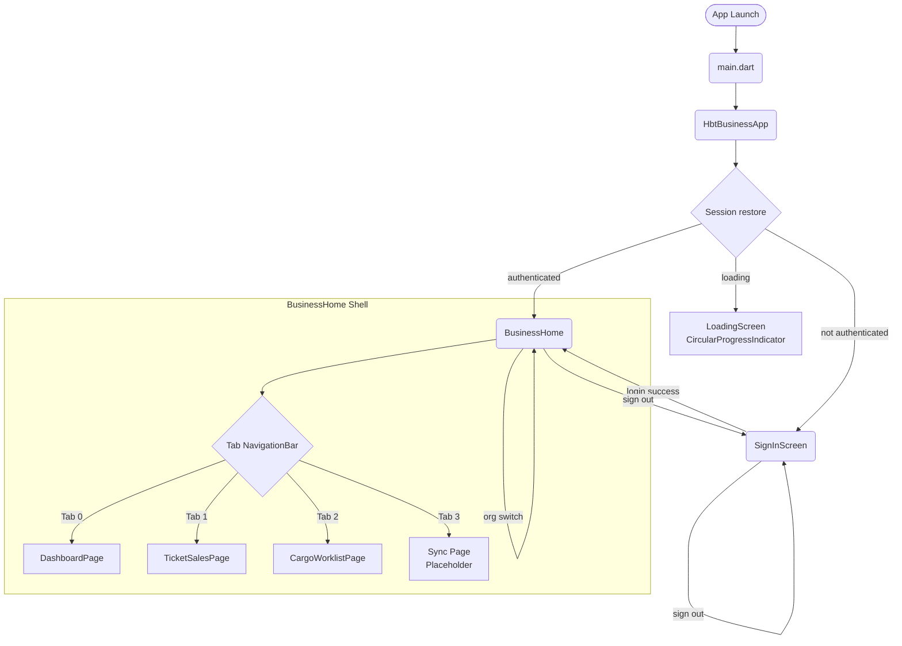
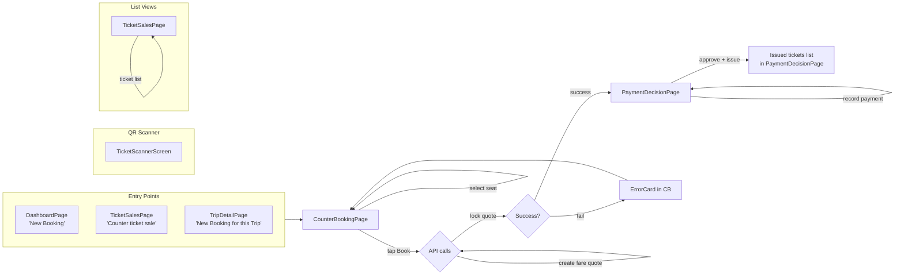
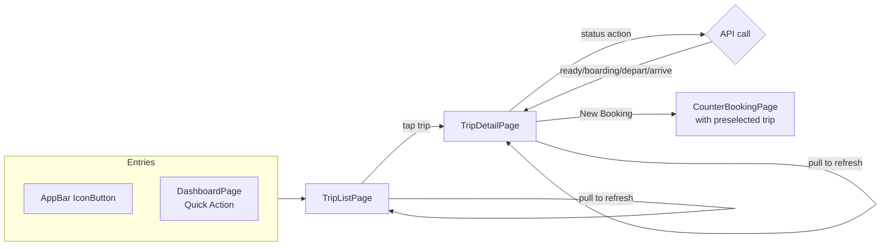
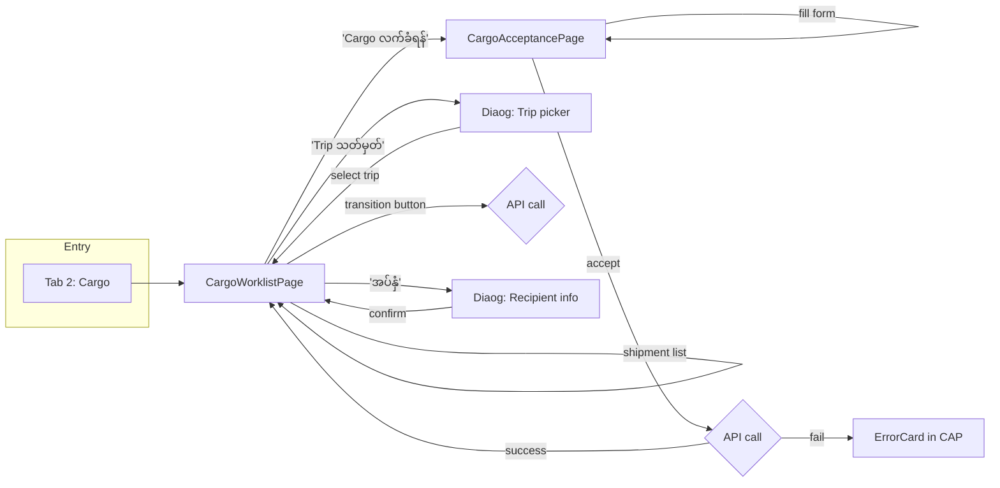
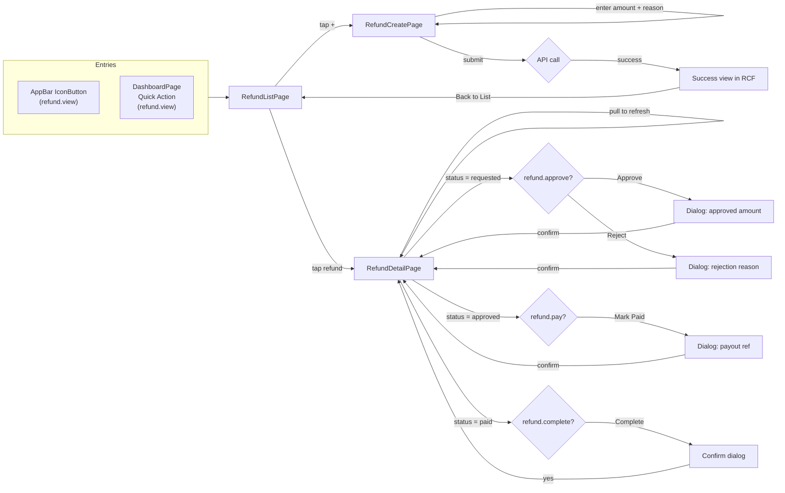
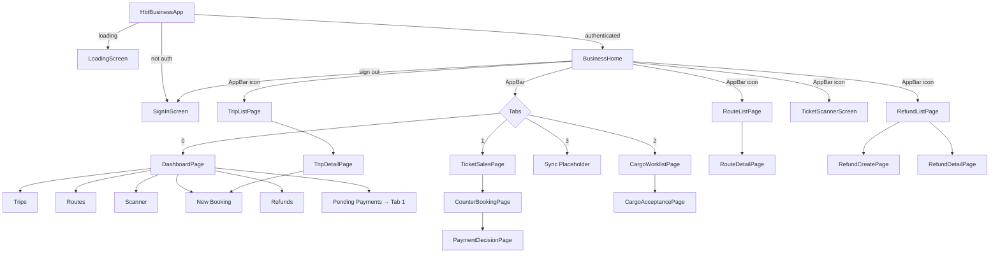

# Business App — Navigation Map

**Format:** Mermaid flow diagrams

---

## 1. Top-Level Navigation



---

## 2. Ticket Sales Workflow



---

## 3. Trip Management Workflow



---

## 4. Route Management Workflow

```mermaid
flowchart LR
    subgraph Entries
        APPBAR["AppBar IconButton"]
        DASH_Q["DashboardPage<br/>Quick Action"]
    end

    Entries --> RL[RouteListPage]
    
    RL -->|tap route| RD[RouteDetailPage<br/>Edit mode]
    RL -->|tap +| RD_NEW[RouteDetailPage<br/>Create mode]
    RL -->|pull to refresh| RL
    
    RD -->|save| RD_API{API call}
    RD_API -->|PATCH (edit)| RL
    RD_API -->|POST (create)| RL
```

---

## 5. Cargo Workflow



---

## 6. Refund Workflow



---

## 7. Full Navigation Tree



---

## 8. Navigation Issues

| Issue | Type | Detail |
|-------|------|--------|
| **No splash screen** | Missing | Loading is an inline widget (not a route). On cold start, the session restore shows `CircularProgressIndicator` — no branding. |
| **No named routes** | Architecture | All navigation uses `Navigator.push(MaterialPageRoute(...))`. `routing/routes.dart` exists but is unused. |
| **Placeholder sync tab** | Dead end | Tab 3 shows "Sync and Pending Work is being connected to the API flow." — no navigation targets. |
| **Trip list from AppBar + Dashboard** | Duplicate entry | Trips and Routes are accessible from both the AppBar AND Dashboard quick actions. Same screen, two paths. |
| **Scanner from AppBar + Dashboard** | Duplicate entry | Same pattern. |
| **Refund from AppBar + Dashboard** | Duplicate entry | Same pattern. |
| **PaymentDecisionPage dead end** | UX gap | After tickets are issued, the user sees a ticket list but no "Back to Home" or "Print" action. Must use hardware back. |
| **No booking detail screen** | Missing | After creating a booking + fare quote in CounterBookingPage, the user sees a card tappable to PaymentDecision. But there's no independent booking detail screen showing full booking info. |
| **No ticket detail screen** | Missing | Tickets are shown as `AppListTileCard` with title + subtitle. No detail view with full info. |
| **No cargo detail screen** | Missing | Cargo shipments are shown as list items with status actions. No independent detail page. |
| **No offline entry point** | Missing | The sync tab is a placeholder. No way to view pending operations, retry failed syncs, or see conflicts. |
