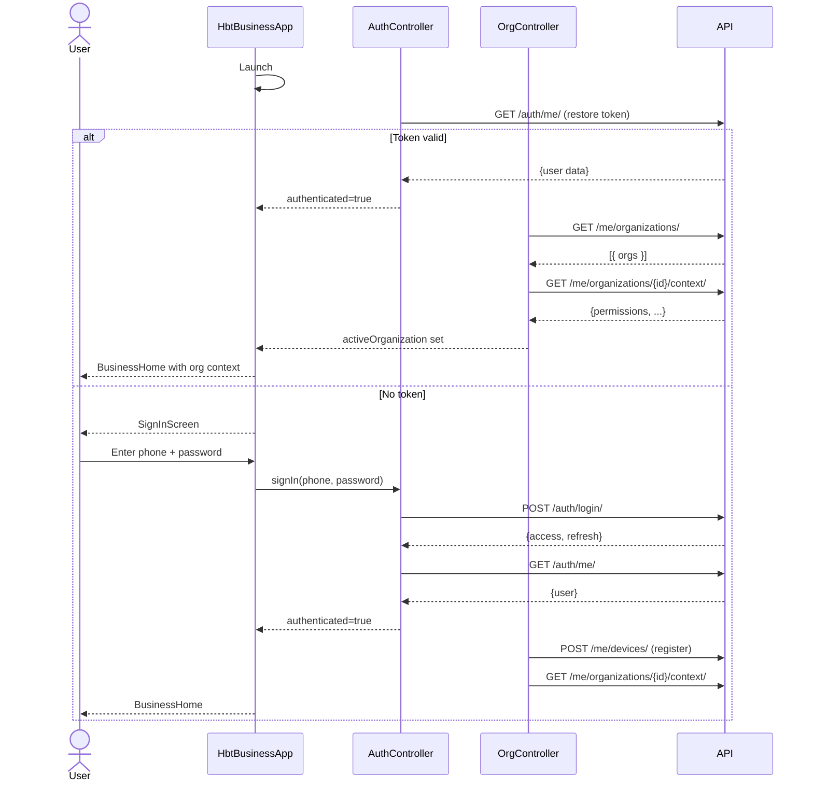
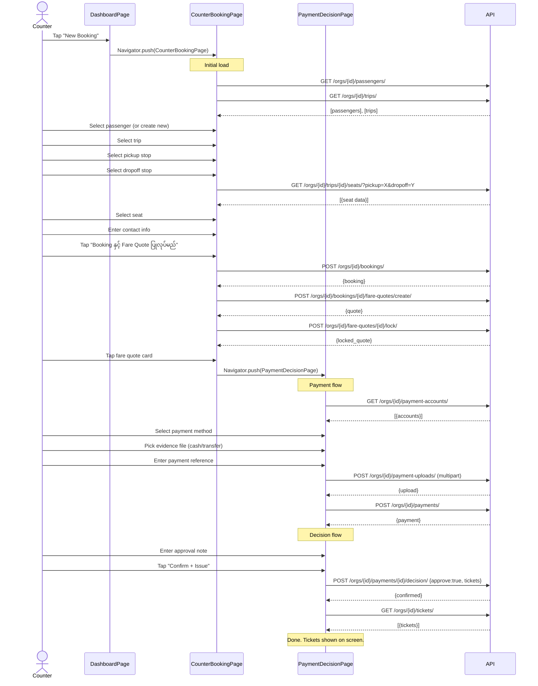
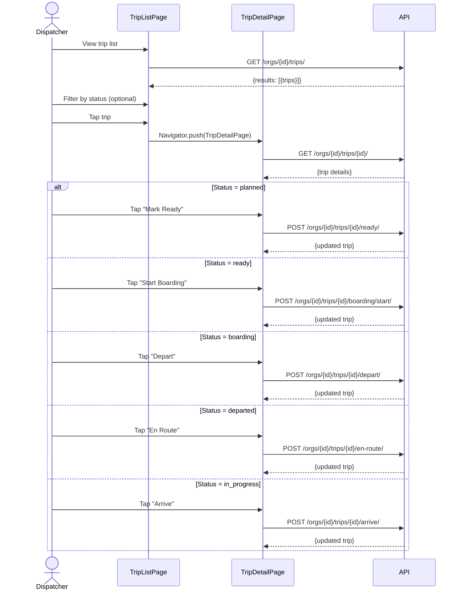
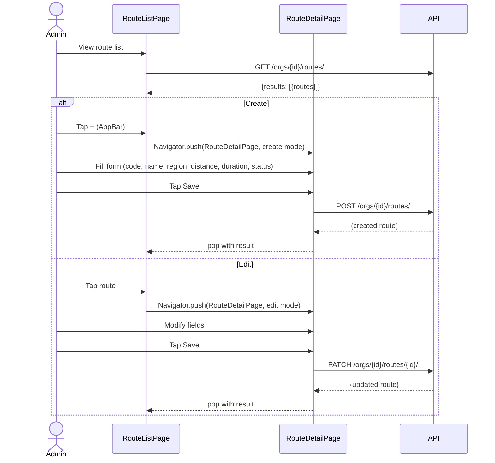
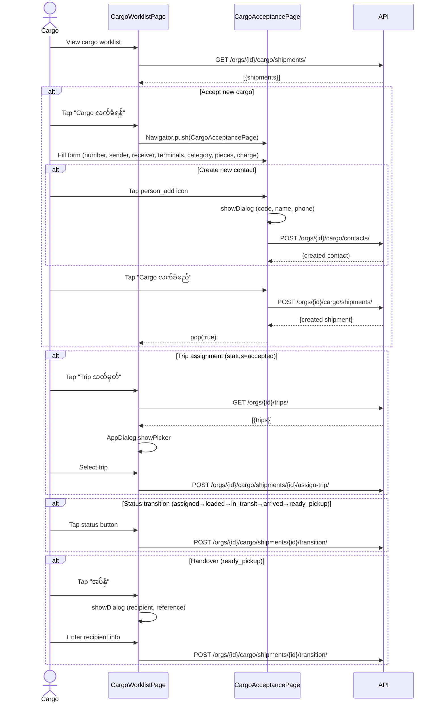
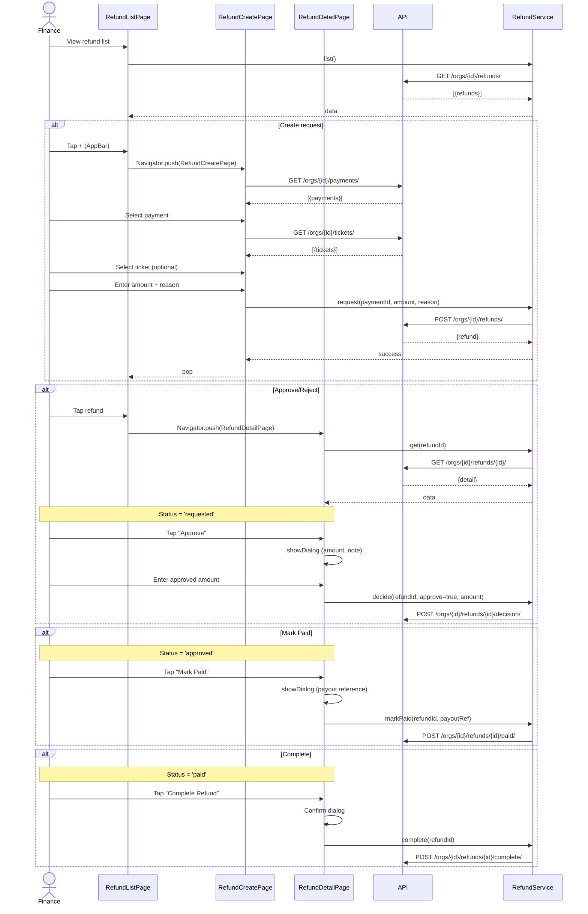
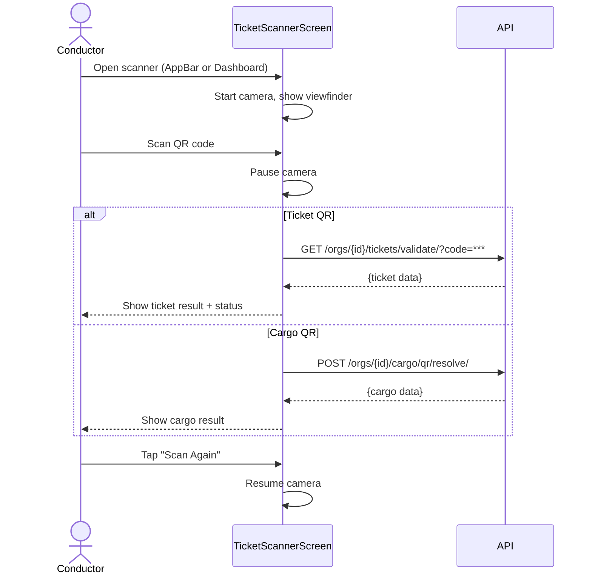
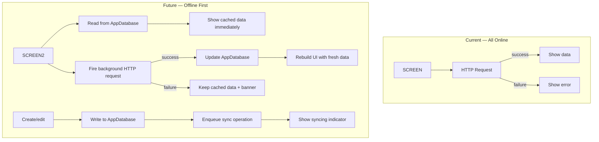

# Business App — User Journeys

---

## 1. Journey Inventory

| # | Journey | Role | Screens visited | API calls | Online? |
|---|---------|------|-----------------|-----------|---------|
| J1 | Sign in + org select | All | 2 | 3 | Required |
| J2 | Counter booking + payment + ticket | Counter | 4 | 6 | Required |
| J3 | Trip list → status transition | Dispatcher | 2 | 3 | Required |
| J4 | Route CRUD | Admin/Manager | 2 | 2-3 | Required |
| J5 | Cargo acceptance → transition → handover | Cargo staff | 2 | 5+ | Required |
| J6 | Refund request → approve → pay | Finance | 3 | 5 | Required |
| J7 | Ticket scanning | Conductor | 1 | 1 | Required |
| J8 | View dashboard | All | 1 | 0 | N/A |

---

## 2. Journey J1: Sign In + Org Select (Happy Path)

**Role:** All users
**Online:** Required (cannot work offline)



**Permission check points:**
- No permission gates at sign-in. Org context loads all permissions for the user.

**Error paths:**
- `E1`: Token expired: refresh attempt → fail → clear → show SignInScreen
- `E2`: Login wrong password: `ScaffoldMessenger.showSnackBar` with error
- `E3`: No organizations: Text("No organization available.") — dead end
- `E4`: Context load error: Error icon + retry button → `loadOrganizationContext()`

---

## 3. Journey J2: Counter Booking → Payment → Ticket Issue (Happy Path)

**Role:** Counter staff
**Online:** Required (all API calls are synchronous HTTP)



**API call count:** 9 (minimum, excluding file upload bytes)

**Permission check points:**
- Entry to CounterBookingPage: requires 5 permissions (`passenger.view`, `passenger.manage`, `trip.view`, `booking.manage`, `fare.quote`)
- Create passenger dialog: `passenger.manage`
- Payment: `payment.record`
- Decision: `payment.confirm` + `ticket.issue`

**Error paths:**
- `E1`: Any API failure → `ErrorCard` at top of current screen → retry by user
- `E2`: Passenger not found → create passenger dialog → POST → error card
- `E3`: Seat double-booked by another counter → API returns error → ErrorCard
- `E4`: Fare quote lock fails → ErrorCard → booking abandoned mid-flow

**Offline path:** **None.** Every API call is synchronous HTTP. No offline queue. No local storage.

---

## 4. Journey J3: Trip → Status Transition (Happy Path)

**Role:** Dispatcher
**Online:** Required



**API call count:** 2 + N (N = number of transitions)

**Permission check points:** No permission gates on any status transition action.

**Error paths:**
- `E1`: Trip not found (refreshed state) → ErrorCard
- `E2`: Invalid transition (server rejects) → ErrorCard → snackbar

**Offline path:** **None.** No offline trip transition queue.

---

## 5. Journey J4: Route CRUD

**Role:** Admin / Manager
**Online:** Required



**API call count:** 2 (list + create/edit)

**Permission gaps:**
- No `route.view` gate on RouteListPage
- No `route.manage` gate on RouteDetailPage create/edit

---

## 6. Journey J5: Cargo Acceptance → Transition → Handover

**Role:** Cargo staff
**Online:** Required



**API call count:** 2-6 per flow segment

**Permission check points:**
- `cargo.view` gates entire CargoWorklistPage
- `cargo.accept` gates the "Cargo လက်ခံရန်" button
- `cargo.manage` gates all action buttons (trip assignment, transition, handover)

---

## 7. Journey J6: Refund Request → Approve → Pay → Complete

**Role:** Finance staff
**Online:** Required



**API call count:** 2-5 per flow segment

**Permission check points:**
- `refund.view`: list page entry + AppBar icon
- `refund.request`: create button
- `refund.approve`: approve/reject buttons
- `refund.pay`: mark paid button
- `refund.complete`: complete button

---

## 8. Journey J7: Ticket Scanning

**Role:** Conductor
**Online:** Required



**Note:** The ticket validation endpoint uses a hardcoded `?code=***` placeholder — this is a bug (see validation).

---

## 9. Offline Paths

**Current state:** No offline paths exist. The app is fully online-only.

### 9.1 What would change



### 9.2 Screens with offline entry points

| Screen | Read offline? | Write offline? | Sync status? |
|--------|--------------|----------------|--------------|
| SignInScreen | ❌ | ❌ | ❌ |
| DashboardPage | ❌ | N/A | ❌ |
| TicketSalesPage | ❌ | N/A | ❌ |
| CounterBookingPage | ❌ | ❌ | ❌ |
| PaymentDecisionPage | ❌ | ❌ | ❌ |
| TicketScannerScreen | ❌ | ❌ | ❌ |
| TripListPage | ❌ | N/A | ❌ |
| TripDetailPage | ❌ | ❌ | ❌ |
| RouteListPage | ❌ | N/A | ❌ |
| RouteDetailPage | ❌ | ❌ | ❌ |
| CargoWorklistPage | ❌ | N/A | ❌ |
| CargoAcceptancePage | ❌ | ❌ | ❌ |
| RefundListPage | ❌ | N/A | ❌ |
| RefundCreatePage | ❌ | ❌ | ❌ |
| RefundDetailPage | ❌ | ❌ | ❌ |
| SyncPlaceholder | N/A | N/A | N/A (placeholder) |

---

## 10. Role-Based Access Matrix

| Screen / Feature | Admin | Manager | Counter | Dispatcher | Cargo | Conductor | Finance |
|-----------------|-------|---------|---------|------------|-------|-----------|---------|
| **Dashboard** | ✅ | ✅ | ✅ | ✅ | ✅ | ✅ | ✅ |
| **Trips** (list) | ✅ | ✅ | ✅ | ✅ | ❌ | ✅ | ❌ |
| **Trips** (status transition) | ❌ | ✅ | ❌ | ✅ | ❌ | ❌ | ❌ |
| **Routes** (view) | ✅ | ✅ | ❌ | ✅ | ❌ | ❌ | ❌ |
| **Routes** (create/edit) | ✅ | ✅ | ❌ | ❌ | ❌ | ❌ | ❌ |
| **Booking** (view) | ✅ | ✅ | ✅ | ❌ | ❌ | ❌ | ❌ |
| **Booking** (create) | ❌ | ✅ | ✅ | ❌ | ❌ | ❌ | ❌ |
| **Payment** (record) | ❌ | ✅ | ✅ | ❌ | ❌ | ❌ | ❌ |
| **Payment** (confirm) | ❌ | ✅ | ❌ | ❌ | ❌ | ❌ | ❌ |
| **Tickets** (issue) | ❌ | ✅ | ✅ | ❌ | ❌ | ❌ | ❌ |
| **Tickets** (scan) | ❌ | ❌ | ❌ | ❌ | ❌ | ✅ | ❌ |
| **Cargo** (view) | ✅ | ✅ | ❌ | ❌ | ✅ | ❌ | ❌ |
| **Cargo** (accept) | ❌ | ✅ | ❌ | ❌ | ✅ | ❌ | ❌ |
| **Cargo** (manage transitions) | ❌ | ✅ | ❌ | ❌ | ✅ | ❌ | ❌ |
| **Refund** (view) | ✅ | ✅ | ❌ | ❌ | ❌ | ❌ | ✅ |
| **Refund** (request) | ❌ | ✅ | ❌ | ❌ | ❌ | ❌ | ✅ |
| **Refund** (approve) | ❌ | ✅ | ❌ | ❌ | ❌ | ❌ | ✅ |
| **Refund** (pay) | ❌ | ❌ | ❌ | ❌ | ❌ | ❌ | ✅ |
| **Refund** (complete) | ❌ | ❌ | ❌ | ❌ | ❌ | ❌ | ✅ |
| **QR Scanner** | ✅ | ✅ | ❌ | ❌ | ✅ | ✅ | ❌ |
| **Sync dashboard** | ✅ | ✅ | ✅ | ✅ | ✅ | ✅ | ✅ |

**Permission field mapping** (from backend access control matrix):

```
booking: [view, manage]
passenger: [view, manage]
trip: [view]
fare: [quote]
payment: [record, confirm]
ticket: [view, issue]
cargo: [view, accept, manage]
refund: [view, request, approve, pay, complete]
route: [view, manage]
```

---

## 11. Recommended Navigation Improvements

| Priority | Change | Rationale |
|----------|--------|-----------|
| **High** | Add permission gates to TripListPage (`trip.view`) and RouteListPage (`route.view`) | Currently all users see these screens even without permission |
| **High** | Add permission gate to RouteDetailPage create/edit (`route.manage`) | Admin data can be modified by any user |
| **High** | Add splash screen with branding | Currently shows blank `CircularProgressIndicator` |
| **Medium** | Move "Trips" and "Routes" from AppBar to Dashboard only | Reduces AppBar clutter; dashboard is the hub |
| **Medium** | Merge dashboard quick actions into a grid (not ListView) | Better use of space on larger screens |
| **Medium** | Add "Back to Home" to PaymentDecisionPage after ticket issue | Current dead end requires hardware back |
| **Medium** | Add booking detail screen | CounterBookingPage only shows summary card after booking |
| **Medium** | Add cargo detail screen | No detail view for cargo shipments |
| **Low** | Add ticket detail screen | Tickets shown as list items only |
| **Low** | Rename `features/business/` → `features/shell/` | It's not a feature, it's the app shell |
| **Low** | Consolidate AppBar + Dashboard duplicate navigation paths | Trips, Routes, Scanner, Refunds accessible from both |
