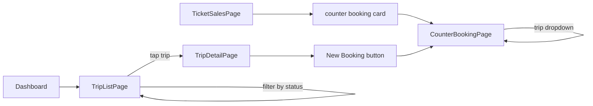
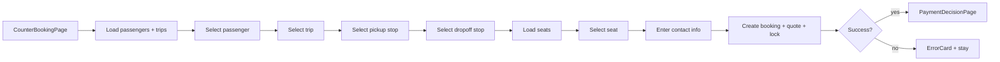
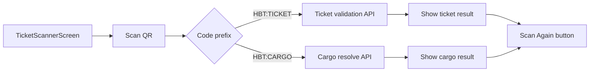
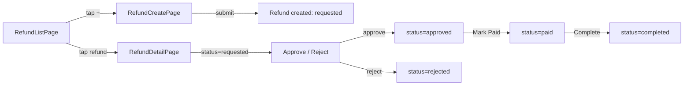

# Business Workflow Verification

**App:** hbt_business_app
**Date:** 2026-07-30
**Source:** 17 screens, 3 controllers, 3 services, 5 API endpoint patterns

---

## Workflow Inventory

| # | Workflow | Startup | Requires | Implemented |
|---|----------|---------|----------|-------------|
| W1 | Start Shift | Session | Auth, org context | ✅ Partial |
| W2 | Open Counter | Daily | Counter assignment | ❌ Missing |
| W3 | Trip Selection | Shift | Trip list, date | ✅ |
| W4 | Walk-in Booking | Counter | Passenger, trip, seat | ✅ Partial |
| W5 | Seat Reservation | Booking | Seat lock protocol | ❌ Missing |
| W6 | Payment | Booking | Payment accounts, upload | ✅ |
| W7 | Ticket Printing | Payment | Printer, ticket number | ❌ Missing |
| W8 | Passenger Check-in | Trip | QR validation | ✅ Partial |
| W9 | Boarding | Trip | Status transition | ✅ |
| W10 | Trip Departure | Boarding | Status transition | ✅ |
| W11 | Refund | Any | Refund policy, payment | ✅ |
| W12 | Trip Closing | Arrival | Status transition | ✅ |
| W13 | End Shift | All day | Cash count, reports | ❌ Missing |
| W14 | Cash Reconciliation | End shift | Payment records, reports | ❌ Missing |
| W15 | Offline Sync | Continuous | Network, sync infra | ❌ Missing |

---

## W1: Start Shift

### Real-world flow
```
1. Staff arrives at counter
2. Opens app on counter device (primary or spare)
3. Enters credentials (phone + password)
4. App performs session restore or login
5. App loads organization context + permissions
6. Staff sees dashboard with today's trips, pending tasks
```

### Current implementation

```mermaid
flowchart LR
    A[App Launch] --> B[Session restore]
    B -->|token valid| C[Load org context]
    B -->|no token| D[SignInScreen]
    D -->|login| C
    C -->|success| E[BusinessHome<br/>Dashboard Tab]
    C -->|error| F[Error + Retry]
    C -->|no orgs| G[Dead end: "No organization"]
```

**Screens:** LoadingScreen → SignInScreen → BusinessHome (Tab 0: Dashboard)
**API calls:** `GET /auth/me/`, `POST /auth/login/`, `GET /me/organizations/`, `GET /me/organizations/{id}/context/`
**Success state:** User reaches DashboardPage with active org + permissions loaded.

### Gaps

| Gap | Impact | Severity |
|-----|--------|----------|
| No "device assignment" — any device can be used by any staff | No audit trail per device | 🟡 Medium |
| No "today's trips" shown on dashboard | Staff must manually navigate to TripListPage | 🟡 Medium |
| No pending tasks / notifications on dashboard | Staff doesn't know what needs attention | 🟡 Low |
| No previous shift handover state | Staff doesn't know what happened before their shift | 🟢 Low |

---

## W2: Open Counter

### Real-world flow
```
1. Staff opens their assigned counter for the day
2. System records: "Counter C-01, staff X, opened at 08:00"
3. Counter receives cash float (opening balance)
4. Counter status changes from "closed" to "open"
5. Only this counter's bookings are accepted
```

### Current implementation

**Not implemented.** There is no counter concept in the codebase. `SessionController` loads organizations but has no notion of:
- Counter ID
- Counter status (open/closed)
- Opening balance / cash float
- Counter assignment to staff

### What exists (partial)

The `OrgController` has `OrganizationContext` which includes `permissions`. But there is no `Counter` model, no counter management API endpoint, and no screen to open/close a counter.

### Gaps

| Gap | Impact | Severity |
|-----|--------|----------|
| No counter model | Staff identity is user-level, not counter-level | 🔴 High |
| No counter open/close API | Audit log missing | 🔴 High |
| No opening cash balance | Cash reconciliation impossible | 🔴 High |
| No counter assignment | Two staff at same counter can't be distinguished | 🟡 Medium |

### Required additions

```
New model: Counter { id, code, organization_id, status, current_staff_id, opened_at, closed_at }
New API:  POST /orgs/{id}/counters/{id}/open/
          POST /orgs/{id}/counters/{id}/close/
          GET  /orgs/{id}/counters/{id}/status/
New screen: OpenCounterScreen (dialog or full screen)
```

---

## W3: Trip Selection

### Real-world flow
```
1. Staff views available trips for today
2. Filters by route, departure time, status (planned/ready)
3. Selects a trip to work with
4. Option comes from a passenger walk-in
```

### Current implementation



**Screens:** TripListPage → TripDetailPage → CounterBookingPage (preselected trip)
**API:** `GET /orgs/{id}/trips/` (returns `{results: [...]}`)
**Filtering:** Client-side only for status (`planned`, `ready`). No server-side date filtering.

### Gaps

| Gap | Impact | Severity |
|-----|--------|----------|
| No date filter in API call | Service_date filter applied client-side only | 🟡 Medium |
| No route filter | Staff scrolls all trips | 🟢 Low |
| No seat summary on trip list | Staff can't see remaining seats at a glance | 🟢 Low |

---

## W4: Walk-in Booking

### Real-world flow
```
1. Passenger arrives at counter
2. Staff asks: destination, date, number of passengers
3. Staff searches available trips
4. Staff selects trip, pickup/dropoff stops
5. Staff selects seats
6. Staff creates booking
7. Fare is quoted, locked
8. Passenger proceeds to payment
```

### Current implementation



**Screens:** CounterBookingPage (form) → PaymentDecisionPage
**API calls:** `GET /passengers/`, `GET /trips/`, `GET /trips/{id}/seats/`, `POST /bookings/`, `POST /fare-quotes/create/`, `POST /fare-quotes/{id}/lock/`

**Permission:** Entry requires 5 permissions (`passenger.view`, `passenger.manage`, `trip.view`, `booking.manage`, `fare.quote`). Create passenger dialog requires `passenger.manage`.

### Gaps

| Gap | Impact | Severity |
|-----|--------|----------|
| No multiple-passenger booking | Only 1 passenger at a time | 🟡 Medium |
| No reservation hold / seat lock | Two counters can book same seat | 🔴 High |
| No fare rule display | Staff can't see how fare was calculated | 🟢 Low |
| No discount/override UI | Fare amount shown but can't be adjusted | 🟢 Low |
| No customer lookup (phone) | Staff must know passenger code | 🟡 Medium |

---

## W5: Seat Reservation

### Real-world flow
```
1. Staff assigns specific seat(s) to passenger(s)
2. Seat is held for 5 minutes during booking/payment
3. Other staff at same counter see seat as held
4. Other staff at different counters see seat as held
5. If payment not completed in 5 min, seat auto-releases
6. Staff can extend the hold if needed
```

### Current implementation

**Not implemented.** The counter booking page does load and display seats via `ChoiceChip`:

```dart
// counter_booking_page.dart
ChoiceChip(
  label: Text(item['identifier']),
  selected: _seat?['id'] == item['id'],
  onSelected: item['available'] == true ? (_) => setState(() => _seat = item) : null,
)
```

But there is no:
- Seat locking mechanism (local or server-side)
- Hold timer / countdown UI
- Hold extension
- Cross-device lock sync
- Lock expiry handling

### Gaps

| Gap | Impact | Severity |
|-----|--------|----------|
| No seat lock protocol | Double-booking possible when two counters select same seat | 🔴 Critical |
| No hold timer | Staff can hold a seat indefinitely by staying on the form | 🔴 High |
| No cross-device seat state | Counter B doesn't know Counter A is booking seat 12 | 🔴 High |

### Required additions (from OFF-001 design)

```
New table: seat_locks { trip_id, seat_position, device_id, held_at, expires_at, status }
New API:   POST /orgs/{id}/trips/{id}/seats/{id}/lock/
           POST /orgs/{id}/trips/{id}/seats/{id}/unlock/
           POST /orgs/{id}/trips/{id}/seats/{id}/extend/
Local:     seat_lock protocol with 5-minute TTL + countdown UI
```

---

## W6: Payment

### Real-world flow
```
1. Fare quote is presented to passenger
2. Passenger pays (cash / QR / bank transfer)
3. Staff records payment with evidence (photo/ref)
4. Payment is matched to booking
5. If auto-confirmed: ticket is issued
6. If manual review: supervisor approves
```

### Current implementation



```mermaid
flowchart LR
    A[PaymentDecisionPage] --> B[Load payment accounts]
    B --> C[Select payment method]
    C --> D[Select receiving account]
    D --> E[Upload evidence file]
    E --> F[Enter payment reference]
    F --> G[Record payment]
    G --> H{Status}
    H -->|recorded| I[Enter approval note]
    I --> J[Confirm + Issue tickets]
    H -->|submitted| I
    J --> K[Show issued tickets]
```

**Screens:** PaymentDecisionPage (single page with state transitions)
**API calls:** `GET /payment-accounts/`, `POST /payment-uploads/`, `POST /payments/`, `POST /payments/{id}/decision/`, `GET /tickets/`

### Gaps

| Gap | Impact | Severity |
|-----|--------|----------|
| No cash drawer integration | Manual cash handling, no system count | 🟡 Medium |
| No partial payment flow | Full payment required per seat | 🟢 Low |
| No payment receipt print | No physical receipt for passenger | 🟡 Medium |
| No payment reversal UI | Must go through refund workflow | 🟢 Low |
| File evidence upload size limit | Large files may fail | 🟢 Low |

---

## W7: Ticket Printing

### Real-world flow
```
1. After payment confirmed, ticket is issued
2. Ticket is printed on thermal printer at counter
3. Passenger receives printed ticket with:
   - Ticket number (barcode/QR)
   - Passenger name
   - Trip: route, date, departure time
   - Seat number
   - Fare paid
```

### Current implementation

**Not implemented.** After `PaymentDecisionPage._decide()` succeeds, tickets are shown as in-app `AppListTileCard` widgets:

```dart
if (_tickets.isNotEmpty) ...[
  const SizedBox(height: 20),
  Text('Issued Tickets', style: Theme.of(context).textTheme.titleMedium),
  ..._tickets.map(
    (ticket) => AppListTileCard(
      title: ticket['ticket_number']?.toString() ?? 'Ticket',
      subtitle: ticket['passenger_name']?.toString() ?? '',
    ),
  ),
],
```

There is no:
- Printer integration (Bluetooth/network thermal printer)
- Ticket template / layout
- Reprint functionality
- Print queue (for batch printing)

### Gaps

| Gap | Impact | Severity |
|-----|--------|----------|
| No printer driver | Cannot print tickets at counter | 🔴 High |
| No ticket template | No layout for ticket content | 🔴 High |
| No reprint UI | If printer jams, cannot reprint | 🟡 Medium |

### Required additions

```
New service: TicketPrintService (thermal printer bridge)
New screen: PrintDialog (select printer, preview, retry)
New API:    GET /orgs/{id}/tickets/{id}/print-data/
```

---

## W8: Passenger Check-in

### Real-world flow
```
1. Passenger arrives at terminal/departure gate
2. Conductor scans ticket QR code on passenger's ticket
3. System validates ticket: not expired, not already used
4. Ticket status changes from "issued" → "validated"
5. Passenger boards
```

### Current implementation



**Screens:** TicketScannerScreen
**API:** `GET /tickets/validate/?code=***` (ticket), `POST /cargo/qr/resolve/` (cargo)

### Critical bug

The ticket validation API path has a hardcoded `?code=***` placeholder — the actual QR code is never included in the URL:

```dart
final found = await widget.session.api.get(
  '/organizations/$_organizationId/tickets/validate/?code=***',
);
```

This means the server always receives `?code=***` regardless of what was scanned.

### Gaps

| Gap | Impact | Severity |
|-----|--------|----------|
| QR code not passed to API | Ticket validation always fails with wrong code | 🔴 Critical |
| No validation state change | Ticket status not updated | 🟡 Medium |
| No offline validation | Cannot validate if network is down | 🟡 Medium |

---

## W9: Boarding

### Real-world flow
```
1. Conductor has trip manifest (passenger list with seat assignments)
2. As each passenger boards, conductor validates their ticket
3. System marks passenger as "boarded"
4. Un-boarded passengers are identified
5. No-show passengers are noted
```

### Current implementation

Boarding is partially implemented as a trip status transition:

```dart
case 'planned':
  addAction('ready', 'Mark Ready', Icons.check_circle_outline);
  break;
case 'ready':
  addAction('boarding', 'Start Boarding', Icons.door_front_door);
  break;
case 'boarding':
  addAction('depart', 'Depart', Icons.directions_bus);
  break;
```

**Screens:** TripDetailPage (status actions)
**API:** `POST /trips/{id}/ready/`, `POST /trips/{id}/boarding/start/`

### Gaps

| Gap | Impact | Severity |
|-----|--------|----------|
| No passenger manifest view | Conductor can't see who should board | 🔴 High |
| No per-passenger check-in tracking | Boarding status is trip-level, not passenger-level | 🔴 High |
| No no-show tracking | Missing passengers not recorded | 🟡 Medium |
| No boarding count | Total boarded vs. total booked un tracked | 🟢 Low |

---

## W10: Trip Departure

### Real-world flow
```
1. All boarding passengers are checked in
2. Conductor confirms departure
3. Trip status: boarding → departed → in_progress
4. System records actual departure time
5. Ticket validation closes (no more check-ins)
```

### Current implementation

```mermaid
flowchart LR
    A[TripDetailPage] -->|status=boarding| B[ActionChip: "Depart"]
    B --> C[POST /trips/{id}/depart/]
    C -->|status=departed| D[ActionChip: "En Route"]
    D --> E[POST /trips/{id}/en-route/]
    E -->|status=in_progress| F[ActionChip: "Arrive"]
    F --> G[POST /trips/{id}/arrive/]
    G -->|status=arrived| H[No more actions]
```

**Screens:** TripDetailPage
**API:** `POST /trips/{id}/depart/`, `POST /trips/{id}/en-route/`, `POST /trips/{id}/arrive/`

### Gaps

| Gap | Impact | Severity |
|-----|--------|----------|
| No pre-departure checklist | No verification of departure readiness | 🟢 Low |
| No "delayed" status option | Trip detail shows "Departed" action only | 🟡 Medium |
| No actual departure time recording | API should return server timestamp | 🟢 Low |

---

## W11: Refund

### Real-world flow
```
1. Passenger requests refund (at counter or by phone)
2. Staff looks up booking/payment
3. Staff creates refund request with reason
4. Supervisor approves/rejects
5. Finance processes payment
6. Ticket is cancelled (if already issued)
7. Refund is completed
```

### Current implementation



**Screens:** RefundListPage → RefundCreatePage, RefundDetailPage
**API:** `GET/POST /refunds/`, `POST /refunds/{id}/decision/`, `POST /refunds/{id}/paid/`, `POST /refunds/{id}/complete/`
**Service:** `RefundService` (the only feature with a proper service layer)

### Gaps

| Gap | Impact | Severity |
|-----|--------|----------|
| No refund policy display | Staff must know policy manually | 🟢 Low |
| No partial refund for multi-passenger bookings | Full booking refund only | 🟡 Medium |
| No ticket auto-cancellation on complete | Must be handled by backend | 🟡 Medium |

---

## W12: Trip Closing

### Real-world flow
```
1. Trip arrives at destination
2. Conductor marks trip as "arrived"
3. Final passenger count is recorded
4. Any exceptions/incidents are noted
5. Trip is "closed" — no further modifications
```

### Current implementation

The trip detail page supports the "Arrive" transition:

```dart
case 'in_progress':
  addAction('arrive', 'Arrive', Icons.location_on);
  break;
```

After arrival, there are no more status action buttons. The trip is terminal at `arrived` status. There is no `closed` status transition.

### Gaps

| Gap | Impact | Severity |
|-----|--------|----------|
| No "closed" status transition | Trip stays at "arrived" forever | 🟢 Low |
| No post-trip summary | System doesn't show trip completion data | 🟢 Low |
| No incident/notes finalization | Notes entered mid-trip can be modified after | 🟢 Low |

---

## W13: End Shift

### Real-world flow
```
1. Staff closes their counter for the day
2. System records: "Counter C-01, staff X, closed at 17:00"
3. Counter status changes from "open" to "closed"
4. All pending bookings for this counter must be completed or cancelled
5. Shift summary is generated: total bookings, total revenue
```

### Current implementation

**Not implemented.** There is no:
- Counter close button
- Shift summary screen
- End-of-day reconciliation flow
- Pending booking verification

The only close to an "end" action is `widget.session.signOut()` in the AppBar icon button.

### Gaps

| Gap | Impact | Severity |
|-----|--------|----------|
| No shift close workflow | Staff just signs out — no handover | 🔴 High |
| No pending booking check | Staff can sign out with uncompleted bookings | 🔴 High |
| No shift summary | No daily stats available | 🟡 Medium |

---

## W14: Cash Reconciliation

### Real-world flow
```
1. At end of shift, staff counts cash in drawer
2. System shows expected cash (all cash payments recorded)
3. Staff enters actual cash count
4. System calculates difference (over/short)
5. Difference is logged for audit
6. Cash is handed over to next shift or deposited
```

### Current implementation

**Not implemented.** There is no:
- Cash drawer tracking
- Expected vs. actual cash comparison
- Discrepancy logging
- Handover receipt

### Gaps

| Gap | Impact | Severity |
|-----|--------|----------|
| No cash reconciliation | Cannot audit cash payments | 🔴 Critical |
| No payment method breakdown | Cash vs. QR vs. transfer not tracked per shift | 🔴 High |
| No discrepancy reporting | Over/short amounts go unnoticed | 🔴 High |

---

## W15: Offline Sync

### Real-world flow
```
1. Counter operates normally (online)
2. Network goes down
3. App continues accepting bookings (offline mode)
4. Bookings are stored locally with TMP ticket numbers
5. When network returns, bookings sync to server automatically
6. TMP numbers are replaced with real ticket numbers
7. Staff can see sync status (pending/completed/failed)
8. Conflicts are shown and resolved
```

### Current implementation

**Offline infrastructure EXISTS** (4 files in `infrastructure/offline/`) but is **completely disconnected** from the UI. See `docs/offline_activation_plan.md` for full analysis.

### Gaps

| Gap | Impact | Severity |
|-----|--------|----------|
| No offline queue integration | All screens use direct HTTP | 🔴 Critical |
| Device registry never initialized | SyncManager prerequisite not met | 🔴 High |
| No connectivity monitoring | App doesn't know when offline | 🔴 High |
| No sync status UI | Sync tab is placeholder | 🟡 Medium |
| No conflict dashboard | Conflicts invisible to user | 🟡 Medium |

---

## Summary: Implementation Status

| Workflow | Status | Critical gaps |
|----------|--------|---------------|
| W1: Start Shift | ✅ Partial | No device assignment, no today's trips on dashboard |
| W2: Open Counter | ❌ Missing | No counter model, no open/close API |
| W3: Trip Selection | ✅ | No date/route server-side filter |
| W4: Walk-in Booking | ✅ Partial | No seat lock, single passenger only |
| W5: Seat Reservation | ❌ Missing | No lock protocol, no hold timer, no cross-device sync |
| W6: Payment | ✅ | No cash drawer, no receipt print |
| W7: Ticket Printing | ❌ Missing | No printer driver, no template |
| W8: Passenger Check-in | ✅ Partial | QR code bug (`?code=***`), no status change |
| W9: Boarding | ✅ Partial | No manifest, no per-passenger tracking |
| W10: Trip Departure | ✅ | No delayed status |
| W11: Refund | ✅ | Best implemented workflow (has service layer) |
| W12: Trip Closing | ✅ Partial | No "closed" status, no post-trip summary |
| W13: End Shift | ❌ Missing | No close workflow, no pending check |
| W14: Cash Reconciliation | ❌ Missing | No cash tracking, no discrepancy reporting |
| W15: Offline Sync | ❌ Missing | Infra exists but disconnected |

### Coverage

| Category | Count |
|----------|-------|
| Fully implemented (✅) | 4/15 (W3, W6, W10, W11) |
| Partially implemented (✅ Partial) | 5/15 (W1, W4, W8, W9, W12) |
| Not implemented (❌ Missing) | 6/15 (W2, W5, W7, W13, W14, W15) |

### Critical severity gaps

| Gap | Workflow |
|-----|----------|
| 🔴 No seat lock protocol | W5: Seat Reservation |
| 🔴 No counter model | W2: Open Counter, W13: End Shift |
| 🔴 No cash reconciliation | W14: Cash Reconciliation |
| 🔴 No printer integration | W7: Ticket Printing |
| 🔴 QR code validation bug | W8: Passenger Check-in |
| 🔴 Offline infra disconnected | W15: Offline Sync |
