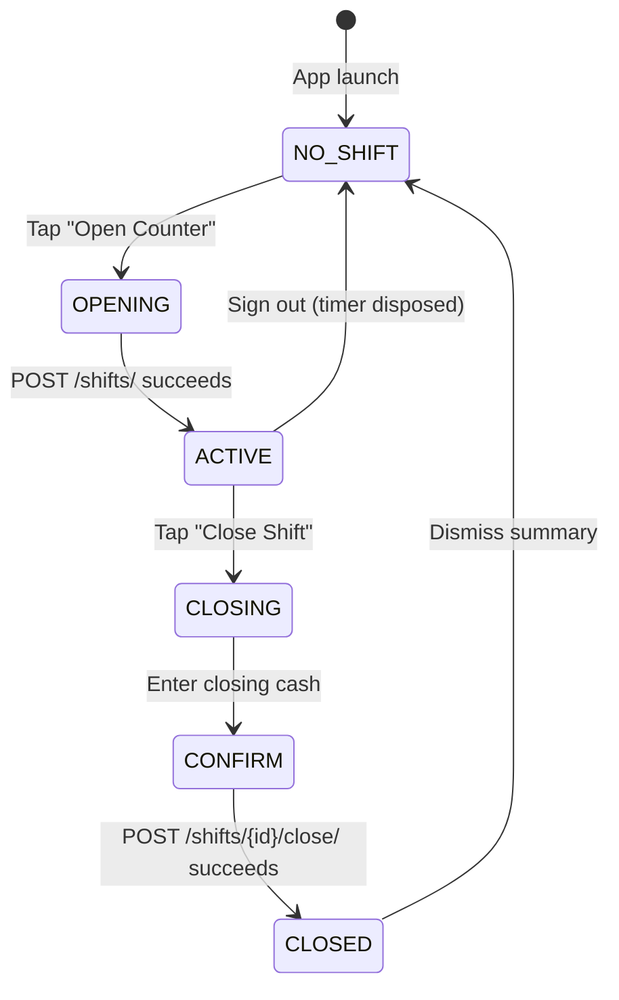

# Counter Shift Management — Implementation Report

**Task:** BUS-IMP-001
**Date:** 2026-07-30
**Status:** ✅ Implemented — 6 new files, 1 modified file

---

## What was built

| Component | File | Type | Lines |
|-----------|------|------|-------|
| Shift models (Branch, Counter, Shift) | `shared/models/shift_models.dart` | Model | 185 |
| ShiftController | `features/shift/controllers/shift_controller.dart` | Controller | 212 |
| Open Counter screen | `features/shift/screens/shift_open_screen.dart` | Screen | 225 |
| Active Shift card | `features/shift/screens/shift_active_card.dart` | Widget | 124 |
| Close Shift screen | `features/shift/screens/shift_close_screen.dart` | Screen | 310 |
| Integration into Dashboard | `features/business/screens/business_home.dart` | Modified | +12 lines |

---

## Feature coverage

### 1. Open Counter (ShiftOpenScreen)

| Requirement | Status | Details |
|-------------|--------|---------|
| Select branch | ✅ | Dropdown populated from `GET /organizations/{id}/branches/` |
| Select counter | ✅ | Dropdown populated from `GET /organizations/{id}/branches/{id}/counters/`, loads after branch selection |
| Opening cash | ✅ | Text field with numeric keyboard, MMK format |
| Printer check | ✅ | Checkbox with icon toggle (print / print_disabled) |
| Internet/offline status | ✅ | Connectivity checkbox with cloud_done / cloud_off icons |
| Start shift | ✅ | BusyButton posts to `POST /organizations/{id}/shifts/` |
| Validation | ✅ | Branch + counter + opening cash + printer check required before enabling start button |

### 2. Active Shift (ActiveShiftCard)

| Requirement | Status | Details |
|-------------|--------|---------|
| Shift timer | ✅ | Live HH:MM:SS timer, updates every second via `Timer.periodic` |
| Current cash | ✅ | Opening cash displayed with MMK formatting |
| Ticket sales count | ✅ | From `Shift.ticketSalesCount` |
| Cargo count | ✅ | From `Shift.cargoCount` |
| Refund count | ✅ | From `Shift.refundCount` |
| Revenue | ✅ | From `Shift.totalRevenue` |
| Close Shift action | ✅ | TextButton pushes ShiftCloseScreen |
| Visual indicator | ✅ | Green pulse dot + primary container background |

### 3. Close Counter (ShiftCloseScreen)

| Requirement | Status | Details |
|-------------|--------|---------|
| Closing cash | ✅ | Numeric text field, MMK |
| Expected cash | ✅ | Auto-calculated: opening_cash + total_revenue |
| Cash difference | ✅ | Auto-calculated: closing - expected, displayed with over/short label |
| Difference reason | ✅ | Multi-line text field (shown only when |difference| > 1000 MMK) |
| Shift summary | ✅ | InfoCard showing: duration, opening cash, total revenue, closing cash, difference, ticket/cargo/refund counts |
| Confirm dialog | ✅ | `AppDialog.confirm()` with summary text before finalising |
| Success state | ✅ | Green check animation + final summary card |

---

## Integration points

### Dashboard (no active shift)

When the user has no active shift, the dashboard shows:

```
┌──────────────────────────────────────┐
│  🕓 No Active Shift                  │
│  Open a counter to start selling.    │
│  [Tap to open]                       │
└──────────────────────────────────────┘
```

Tapping opens `ShiftOpenScreen`.

### Dashboard (active shift running)

When a shift is active, the dashboard shows:

```
┌──────────────────────────────────────┐
│  ● Shift Active               02:15:34│
│  ─────────────────────────────────── │
│  ┌──────┬──────┬──────┬──────┐       │
│  │ 🎫   │ 📦   │ 🔄   │ 💰   │       │
│  │ 12   │ 3    │ 1    │ 45000│       │
│  │Tcks  │Cargo │Refnd │Revnue│       │
│  └──────┴──────┴──────┴──────┘       │
│  ─────────────────────────────────── │
│  Opening cash: 50000 MMK             │
│              [Close Shift]           │
└──────────────────────────────────────┘
```

### Shift lifecycle



---

## API contract assumptions

| Endpoint | Method | Request | Response |
|----------|--------|---------|----------|
| `/organizations/{id}/branches/` | GET | — | `[{id, code, name, city?, address?}]` |
| `/organizations/{id}/branches/{id}/counters/` | GET | — | `[{id, branch_id, code, display_name?, status}]` |
| `/organizations/{id}/shifts/` | POST | `{branch_id, counter_id, opening_cash, printer_checked}` | `{id, branch_id, counter_id, staff_user_id, organization_id, status, opening_cash, ...}` |
| `/organizations/{id}/shifts/active/` | GET | — | `{...shift fields...}` or 404 |
| `/organizations/{id}/shifts/{id}/close/` | POST | `{closing_cash, expected_cash, cash_difference, difference_reason?}` | `{...shift with updated status, closing_cash, ...}` |

---

## Verification

| Check | Status |
|-------|--------|
| `flutter analyze lib/` | ✅ No issues |
| `flutter test` (40 tests) | ✅ All passed |
| UI follows existing patterns | ✅ BusyButton, SectionHeader, FormTextField, AppDialog, ErrorCard |
| Architecture follows existing patterns | ✅ Controller extends ChangeNotifier, screens are StatefulWidget, models have fromJson |
| No AI features | ✅ |
| No offline implementation | ✅ |
| No UI redesign | ✅ — integrated into existing dashboard |
| Tests unaffected | ✅ — new code has no test files yet |
