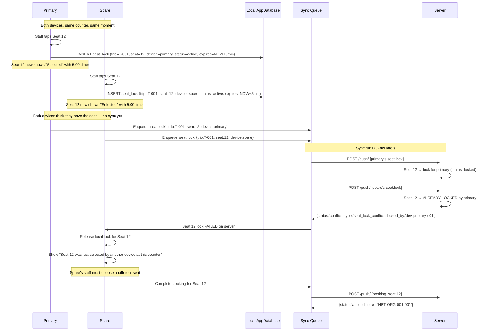
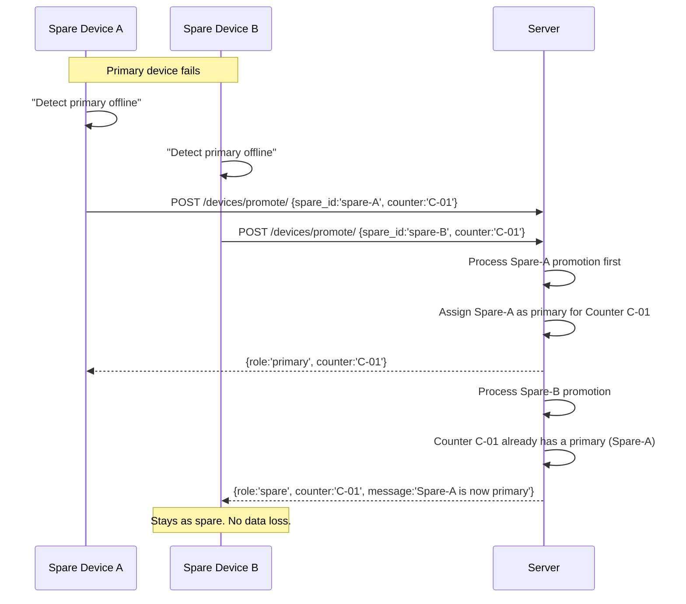
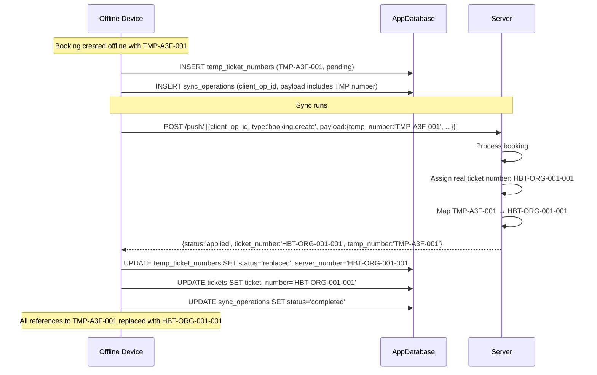
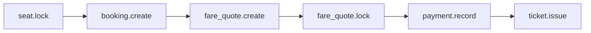
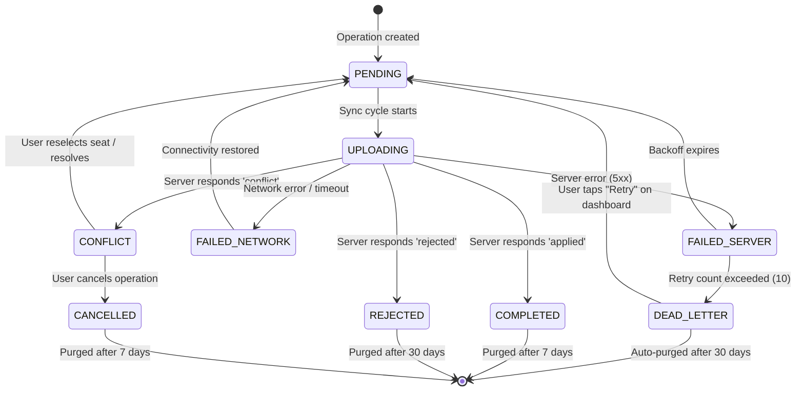
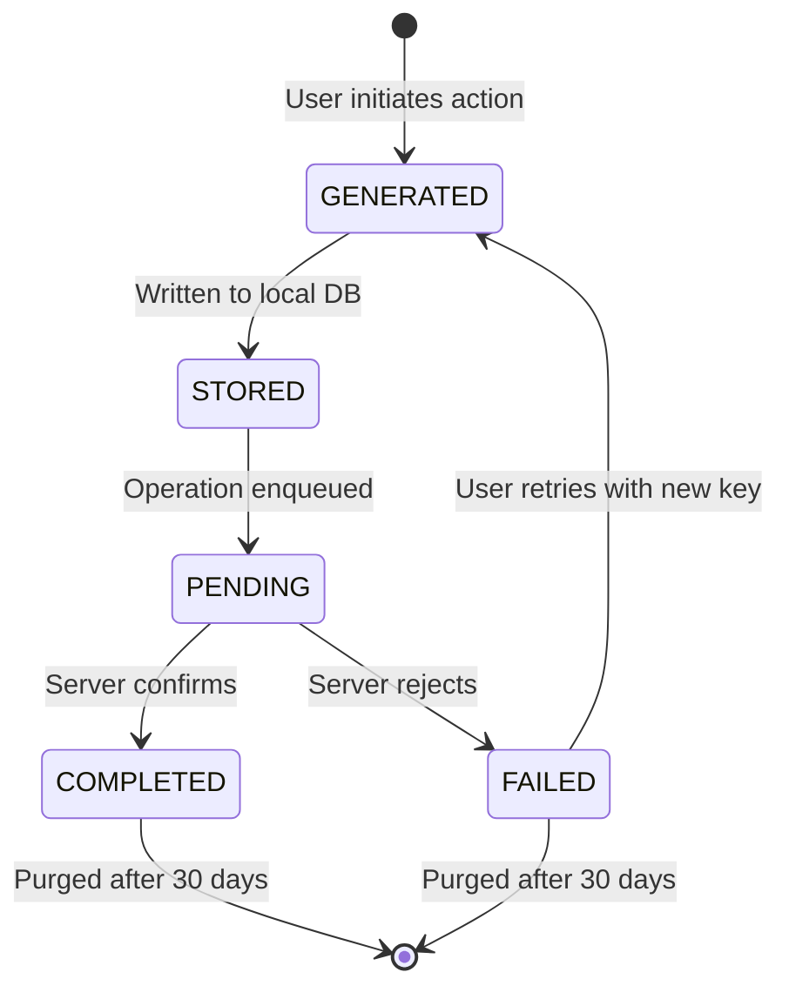
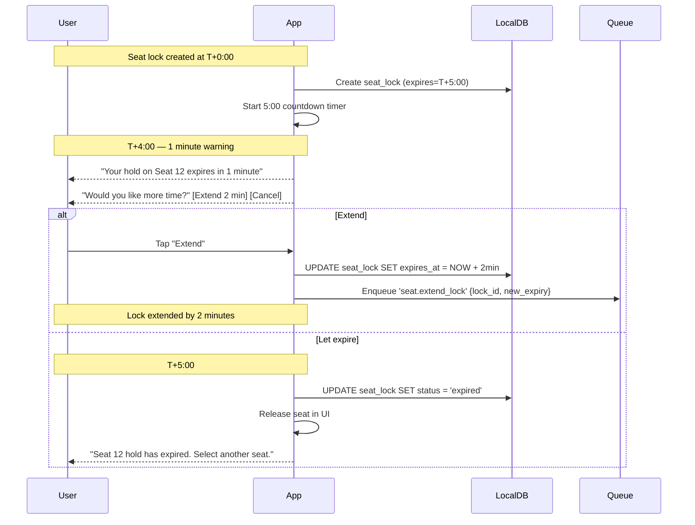

# Offline Booking Strategy — HBT Business App

**Document:** Detailed booking conflict design for multi-device counter environments
**Covers:** Counter+Spare, Spare+Spare, temp numbering, queue ordering, retry, idempotency, seat expiry, clock skew
**Status:** Design proposal

---

## 1. Booking Conflict Landscape

```
                    ┌──────────────────────────────────────┐
                    │          BOOKING CONFLICTS             │
                    └──────────────────────────────────────┘
                                    │
         ┌──────────────────────────┼──────────────────────────┐
         │              ┌───────────┴───────────┐              │
         ▼              ▼                       ▼              ▼
   ┌────────────┐ ┌────────────┐        ┌────────────┐ ┌────────────┐
   │ SEAT        │ │ BOOKING    │        │ TICKET      │ │ SYNC       │
   │ CONFLICT    │ │ IDEMPO-    │        │ NUMBER      │ │ ORDERING   │
   │ (same seat) │ │ TENCY      │        │ CONFLICT    │ │ (dep.      │
   └────────────┘ │ (double-   │        │ (TMP vs     │ │  chain)    │
                  │  tap /      │        │  server)    │ └────────────┘
                  │  network    │        └────────────┘
                  │  retry)     │
                  └────────────┘

        ┌──────────────┐ ┌──────────────┐ ┌──────────────────┐
        │ SEAT LOCK    │ │ RETRY        │ │ CLOCK SKEW       │
        │ EXPIRY       │ │ EXHAUSTION   │ │ (lock TTL drift) │
        │ (crash/      │ │ (dead letter │ └──────────────────┘
        │  offline)    │ │  queue)      │
        └──────────────┘ └──────────────┘
```

---

## 2. Counter + Spare Selling Simultaneously

### 2.1 Physical layout

```
Counter C-01
  ├── Primary device  (device_id: dev-primary-c01)
  └── Spare device    (device_id: dev-spare-c01)
```

Both devices share the same counter ID (`C-01`) and the same staff credentials. Both are authorised to sell tickets for the same trips.

### 2.2 The race

Both devices can accept passengers at the same time. Without a seat locking mechanism, both could sell the same seat.

### 2.3 Resolution design — Three-tier defence

#### Tier 1: Local seat lock (pre-sync)



**Key insight:** Both devices create local locks optimistically. The server resolves the race when sync arrives. The loser's lock is auto-released.

#### Tier 2: Sync queue ordering (push order matters)

The order in which `seat.lock` operations reach the server determines the winner. The queue processes in FIFO order per device, but across devices the order depends on sync timing.

**Mitigation:** The server doesn't just use arrival order. It also checks:

```sql
-- Server-side seat lock acceptance
INSERT INTO seat_locks (trip_id, seat_position, device_id, status, expires_at)
SELECT 'T-001', '12', 'dev-spare-c01', 'locked', NOW() + INTERVAL 5 MINUTE
WHERE NOT EXISTS (
  SELECT 1 FROM seat_locks
  WHERE trip_id = 'T-001'
    AND seat_position = '12'
    AND status IN ('locked', 'converted_to_booking')
    AND expires_at > NOW()
);
```

If the `INSERT` affects 0 rows, the lock was already taken → conflict.

#### Tier 3: Booking finalisation check (last defence)

Even if a seat lock slips through (e.g., lock expired on server but both devices re-locked simultaneously), the final booking creation on the server does a final seat availability check:

```sql
-- Final seat check during booking creation
INSERT INTO bookings (trip_id, seat_position, ...)
SELECT 'T-001', '12', ...
WHERE NOT EXISTS (
  SELECT 1 FROM bookings
  WHERE trip_id = 'T-001'
    AND seat_position = '12'
    AND status NOT IN ('cancelled', 'refunded')
);
```

If this INSERT affects 0 rows, the booking is rejected with `seat_conflict`.

### 2.4 Failure scenario: Both complete booking before sync

```
Time  T0:  Primary & Spare both select Seat 12 (local locks created)
      T1:  Primary staff completes booking form and taps "Confirm"
      T2:  Spare staff does the same
      T3:  Both bookings written to local DB (status='pending_sync')
      T4:  Sync runs for Primary
      T5:  Primary booking succeeds on server (Seat 12 booked)
      T6:  Sync runs for Spare (30s later)
      T7:  Spare booking rejected — seat_conflict

Result:
  - Primary's passenger has a confirmed booking
  - Spare's passenger has a failed booking
  - Spare's screen shows conflict dialog
  - Spare staff must:
    a) Select a different seat for the same passenger, OR
    b) Cancel, explain to the passenger

Impact: One passenger has to wait (30s-60s). No double-booking occurs.
Recovery: Conflict dialog with auto-suggested alternatives (< 10s resolution).
```

---

## 3. Two Spare Devices Selling Simultaneously

### 3.1 Scenario

```
Counter A (Primary):  Online, selling
Counter B (Primary):  Online, selling
Counter B Spare:      Online, selling (same counter as Counter B)
Counter C (Primary):  Online, selling
```

Two spare devices at different counters may compete for the same seat. This is the same as the normal multi-counter scenario — spare devices at different counters have no special affinity.

### 3.2 Spare + Spare at same counter

Two spares at the same counter (e.g., both backup devices activated because primary failed) follow the exact same protocol as Counter + Spare:

- Each spare creates local seat locks independently
- Server resolves races at sync time
- First lock to reach server wins
- Loser gets conflict + auto-suggested alternatives

### 3.3 Spare promotion race

If the primary fails and both spares try to promote simultaneously:



**Resolution:** Server uses atomic counter assignment. First promotion wins. Second stays spare. No split-brain.

---

## 4. Temporary Ticket Numbering

### 4.1 Number format

```
TMP-{device_hash}-{sequence}

TMP-A3F-001
│    │    │
│    │    └── Sequence: monotonically increasing per device
│    │                 (persisted in FlutterSecureStorage)
│    │
│    └── Device short hash: first 3 chars of base64-encoded
│         UUID (each device has a globally unique installation ID)
│
└── Prefix: signals "temporary, not yet confirmed by server"
```

### 4.2 Sequence state machine

```
                    ┌────────────┐
                    │ SEQUENCE   │
                    │ STARTS AT  │
                    │ 0          │
                    └─────┬──────┘
                          │
                    ┌─────▼──────┐
                    │ NEXT CALL  │
                    │ increments │
                    │ to 001     │
                    └─────┬──────┘
                          │
              ┌───────────┴───────────┐
              │                       │
              ▼                       ▼
     ┌────────────────┐    ┌──────────────────┐
     │ ONLINE:         │    │ OFFLINE:          │
     │ Return sequence │    │ Return sequence   │
     │ number only     │    │ number + TMP-     │
     │ (server assigns │    │ prefix            │
     │  real number)   │    └────────┬─────────┘
     └────────────────┘             │
                                    │
                           ┌────────▼─────────┐
                           │ SYNC SUCCEEDS:    │
                           │ real number       │
                           │ replaces TMP      │
                           │ number            │
                           └──────────────────┘
```

### 4.3 Sequence persistence

The sequence counter must survive app restarts and crashes:

```dart
class TicketNumberSequence {
  final FlutterSecureStorage _storage;
  static const _key = 'hbt_ticket_sequence';

  int _counter = 0;
  bool _initialized = false;

  Future<void> initialize() async {
    final stored = await _storage.read(key: _key);
    _counter = int.tryParse(stored ?? '') ?? 0;
    _initialized = true;
  }

  Future<int> next() async {
    if (!_initialized) await initialize();
    _counter++;
    await _storage.write(key: _key, value: _counter.toString());
    return _counter;
  }

  /// Generate a temporary ticket number for offline use.
  Future<String> generateTemp(String deviceId) async {
    final seq = await next();
    final hash = _deviceShortHash(deviceId);
    return 'TMP-$hash-${seq.toString().padLeft(3, '0')}';
  }

  String _deviceShortHash(String deviceId) {
    // Take first 3 chars of the UUID's base36 representation
    final clean = deviceId.replaceAll('-', '');
    return clean.substring(0, 3).toUpperCase();
  }
}
```

### 4.4 Collision analysis

Two devices generate overlapping TMP numbers if they have:

1. The same device_short_hash (impossible — each device has a unique UUID)
2. The same sequence number (possible if both are at sequence 001)

**Result:** `TMP-A3F-001` and `TMP-B7C-001` — different hash, no collision.

**Edge case:** If two devices somehow shared the same installation ID (e.g., cloned app data):
- `TMP-A3F-001` and `TMP-A3F-001` — same hash, same sequence
- First to sync wins. Second booking conflicts.
- Server detects duplicate TMP number → assigns new temp number to second booking
- Conflict log records `temp_number_collision`

### 4.5 Reconciliation on sync



### 4.6 Printed receipt handling

If a receipt was printed with the TMP number:
1. The receipt clearly states **"Temporary — subject to confirmation"**
2. After sync, the booking detail screen shows both numbers:
   - "Ticket: **HBT-ORG-001-001** (was TMP-A3F-001)"
3. A "Reprint" button appears to print a corrected receipt
4. Reprints are tracked: "Reprint #1 of HBT-ORG-001-001 (original TMP-A3F-001)"

### 4.7 Failure scenario: Temp number collision

```
Device A (TMP-A3F-001) and Device B (also TMP-A3F-001 due to cloned install)

Result:
  1. Booking A syncs first → server accepts, assigns HBT-ORG-001-001
  2. Server stores mapping: TMP-A3F-001 → HBT-ORG-001-001
  3. Booking B syncs with same TMP-A3F-001
  4. Server checks temp_number_map → already mapped
  5. Server:
     a. Assigns new temp number: TMP-A3F-002
     b. Processes booking with new temp number
     c. Returns: {status:'applied', temp_number_reassigned:true, original:'TMP-A3F-001', new:'TMP-A3F-002', ticket_number:'HBT-ORG-001-002'}
  6. Device B updates local records to use TMP-A3F-002
  7. No double-booking. No data loss.

User impact: None. Both bookings succeed with different seat numbers.
```

---

## 5. Queue Ordering

### 5.1 Per-device FIFO

Each device maintains its own operation queue ordered by `created_at ASC`. Operations within a device are processed in strict FIFO order.

```sql
SELECT * FROM sync_operations
WHERE device_id = 'dev-primary-c01'
  AND status IN ('pending', 'failed')
ORDER BY created_at ASC
LIMIT 50;
```

### 5.2 Cross-device ordering (no guarantee)

Operations from different devices have no guaranteed ordering. The server processes push batches as they arrive.

**Implication:** If Device A and Device B both try to book Seat 12, the winner is determined by which device's sync batch reaches the server first.

### 5.3 Dependency chain

Some operations depend on others:



The server validates that dependencies are met:

| Operation | Requires | Server validation |
|-----------|----------|-------------------|
| `booking.create` | `seat.lock` (or seat not locked) | Verify seat is available |
| `fare_quote.create` | `booking.create` completed | Verify booking exists |
| `fare_quote.lock` | `fare_quote.create` completed | Verify quote exists |
| `payment.record` | `fare_quote.lock` completed | Verify quote is locked |
| `ticket.issue` | `payment.record` completed | Verify payment recorded |

**If a dependency is missing, the server returns:**

```json
{
  "client_operation_id": "uuid-456",
  "status": "rejected",
  "error_code": "dependency_missing",
  "message": "Cannot create fare quote: booking uuid-123 not found. Check that the booking was synced first.",
  "retryable_after": "booking.uuid-123"  // hint: retry after this op succeeds
}
```

### 5.4 Cross-device dependency handling

If Device A creates a booking and Device B wants to create a fare quote for it, Device B must first pull the completed booking from the server. This is handled by the sync pull cycle — after Device A's push succeeds, Device B's next pull will receive the new booking.

---

## 6. Retry After Reconnect

### 6.1 Retry state machine



### 6.2 Connectivity change handler

```dart
class ConnectivityHandler {
  /// Called when the device transitions from offline → online.
  Future<void> onConnectivityRestored(SyncManager sync) async {
    // 1. Immediate full sync
    await sync.syncAll(activeOrgId);

    // 2. Start periodic sync timer (30s when pending ops, 5min otherwise)
    sync.startPeriodicSync();

    // 3. Notify UI
    notifyListeners();
  }

  /// Called when the device transitions from online → offline.
  void onConnectivityLost(SyncManager sync) {
    // 1. Stop periodic sync timer
    sync.stopPeriodicSync();

    // 2. Show offline banner in UI
    showOfflineBanner();

    // 3. Continue accepting operations (queue-first mode)
    //    No action needed — operations are already queued.
  }
}
```

### 6.3 Retry backoff table

| Attempt | Delay | Cumulative | Notes |
|---------|-------|------------|-------|
| 1 | 2s | 2s | First retry |
| 2 | 4s | 6s | |
| 3 | 8s | 14s | |
| 4 | 16s | 30s | |
| 5 | 32s | 62s | ~1 minute |
| 6 | 64s | 126s | ~2 minutes |
| 7 | 128s | 254s | ~4 minutes |
| 8 | 256s | 510s | ~8.5 minutes |
| 9 | 300s (max) | 810s | ~13.5 minutes |
| 10 | 300s (max) | 1110s | ~18.5 minutes |
| **Dead letter** | — | — | After 10 failed attempts |

### 6.4 Failure scenario: Device stays offline for 8 hours

```
08:00  Device goes offline (network outage)
08:05  5 bookings queued (TMP-A3F-001 through TMP-A3F-005)
08:30  Sync attempt 1 → fails (still offline)
08:35  Sync attempt 2 → fails
08:45  Sync attempt 3 → fails
...
10:00  Sync attempt 10 → fails → moved to dead_letter
10:00  All 5 bookings in dead_letter queue

Impact:
  - Bookings are NOT lost — persisted in AppDatabase
  - TMP numbers preserved in temp_ticket_numbers table
  - Sync dashboard shows 5 pending operations with "Last error: Network error"
  - Staff can manually retry from dashboard

16:00  Device reconnects
16:00  Staff (or auto-retry) taps "Retry All" on dashboard
16:00  All 5 bookings sync successfully
16:01  Server assigns real ticket numbers
16:01  Local DB updated

Result: No data loss. ~8 hour delay between booking and confirmation.
```

---

## 7. Idempotency Keys

### 7.1 Key generation rules

| Operation | Key components | Example |
|-----------|---------------|---------|
| `booking.create` | `booking\|{trip_id}\|{passenger_id}\|{seat_position}\|{counter_id}\|{timestamp_seconds}` | `booking\|t-001\|p-001\|12\|C-01\|1690789200` |
| `fare_quote.create` | `fare_quote\|{booking_id}\|{timestamp_seconds}` | `fare_quote\|bk-001\|1690789200` |
| `fare_quote.lock` | `fare_quote_lock\|{quote_id}\|{timestamp_seconds}` | `fare_quote_lock\|q-001\|1690789200` |
| `payment.record` | `payment\|{booking_id}\|{amount}\|{method}\|{counter_id}\|{timestamp_seconds}` | `payment\|bk-001\|15000\|cash\|C-01\|1690789200` |
| `ticket.issue` | `ticket_issue\|{booking_id}\|{passenger_id}\|{timestamp_seconds}` | `ticket_issue\|bk-001\|p-001\|1690789200` |

**Granularity:** Timestamps are truncated to seconds. Two taps within the same second produce the same key and are deduped.

### 7.2 Key lifecycle



### 7.3 Server-side idempotency

```sql
-- Server processing logic
INSERT INTO processed_operations (client_operation_id, idempotency_key_hash, status, result)
VALUES ('uuid-123', 'sha256-hash', 'processing', NULL)
ON CONFLICT(client_operation_id) DO NOTHING;

-- If INSERT affected 0 rows:
SELECT result FROM processed_operations WHERE client_operation_id = 'uuid-123';
-- Return cached result (idempotent)

-- If INSERT affected 1 row:
-- Process normally
-- UPDATE processed_operations SET status='completed', result=... WHERE client_operation_id='uuid-123';
```

### 7.4 Failure scenario: Server crash mid-processing

```
1. Client sends booking with idempotency_key = "booking|t-001|p-001|12|C-01|1690789200"
2. Server receives, INSERTs into processed_operations (status='processing')
3. Server crashes before creating the booking
4. Server restarts
5. Client retries (same key)
6. Server finds processed_operations entry with status='processing'
7. Server checks: was the booking actually created?
   a. No → clear the stale entry, process fresh
   b. Yes → return cached result
8. Booking is created and confirmed
```

**Safety guarantee:** The server checks business state (actual booking exists?) rather than trusting the stale status. This prevents both duplicate AND lost bookings.

---

## 8. Seat Reservation Expiration

### 8.1 Local TTL (5 minutes)

When a counter staff selects a seat:

```dart
class SeatLock {
  final String id;              // UUID
  final String tripId;
  final String seatPosition;
  final String deviceId;
  final DateTime heldAt;
  final DateTime expiresAt;     // heldAt + 5 minutes
  final SeatLockStatus status;  // active | expired | converted
}
```

The device shows a visible countdown:

```
┌──────────────────────────────┐
│  Seat 12 Selected             │
│  ⏱ Hold expires in 4:32      │
│  [Complete Booking] [Cancel]  │
└──────────────────────────────┘
```

### 8.2 Local expiry behaviour

When the 5-minute timer expires:



### 8.3 Server-side TTL (safety net)

Even if the device crashes and never sends an explicit unlock:

```sql
-- Server-side expiry sweep (runs every 30 seconds)
UPDATE seat_locks
SET status = 'expired'
WHERE status = 'locked'
  AND expires_at < NOW();
```

The server never trusts client-side expiry. The server maintains its own TTL based on when it received the lock.

### 8.4 Failure scenario: Device crashes with active lock

```
1. Staff selects Seat 12 → lock created (expires T+5:00)
2. Device crashes at T+1:00
3. Lock exists in local DB but device is dead
4. T+5:00: Server-side TTL sweep expires the lock
5. Seat 12 returns to "Available" for all other devices
6. Other devices can now book Seat 12

Impact:
  - Seat unavailable for ~5 minutes after crash
  - No manual intervention needed
  - Server auto-recovers

Another device could also force-unlock by:
  1. The other device tries to lock Seat 12
  2. Server checks: existing lock is expired → released
  3. New lock created for the requesting device
```

---

## 9. Clock Skew Between Devices

### 9.1 The problem

Device clocks drift. If Device A is 2 minutes ahead of real time and Device B is 1 minute behind, the effective difference is 3 minutes.

This matters for:
- **Seat lock TTL**: Device A creates a lock that the server thinks expires at a different time
- **Operation ordering**: Operations are ordered by `created_at` which uses device local time
- **Cursor-based sync**: Using wall-clock cursors would break with skew

### 9.2 Mitigations

#### Mitigation 1: Server is the time authority

All TTL calculations use **server time**, not client time.

```dart
// Client sends lock request
Queue.enqueue('seat.lock', {
  'trip_id': 'T-001',
  'seat_position': '12',
  'device_held_at': '2026-07-30T12:00:00+06:30',  // client time (informational)
});

// Server processes lock
Server:
  lock.expires_at = SERVER_NOW() + INTERVAL 5 MINUTE  // server time
```

The client's `device_held_at` is logged but not used for expiry calculation.

#### Mitigation 2: Cursor-based sync, not timestamp-based

The sync cursor is an opaque token (integer sequence, not a timestamp):

```
Client: "Give me everything after cursor 12345"
Server: "Here are changes. New cursor: 12389."
```

This is already implemented in `SyncManager._pullInternal()` — it uses `after=cursor`, not `after=timestamp`.

#### Mitigation 3: Clock drift detection

```dart
class ClockDriftDetector {
  static const Duration maxAllowedDrift = Duration(minutes: 2);

  /// Check clock drift by comparing server and local time.
  /// Called after every successful sync.
  Future<Duration> detectDrift(ApiClient api) async {
    final before = DateTime.now();
    try {
      final response = await api.get('/system/time/');
      final after = DateTime.now();
      final rtt = after.difference(before);
      final serverTime = DateTime.parse(response['server_time'] as String);
      final estimatedServerTime = serverTime.add(rtt ~/ 2);
      final drift = estimatedServerTime.difference(after);
      return drift;
    } catch (_) {
      return Duration.zero; // Can't detect offline
    }
  }

  /// Warn user if drift exceeds limit.
  Future<void> checkAndWarn(BuildContext context, ApiClient api) async {
    final drift = await detectDrift(api);
    if (drift.abs() > maxAllowedDrift) {
      // Show warning: "Device clock is off by X minutes.
      //                This may affect booking timestamps."
    }
  }
}
```

#### Mitigation 4: Graceful degradation with large skew

| Drift | Behaviour |
|-------|-----------|
| 0-2 min | Normal operation |
| 2-5 min | Warning shown, operations proceed |
| 5-15 min | Lock TTL reduced (server-side safety margin) |
| >15 min | Operations queued but flagged. Sync still works. |

### 9.3 Failure scenario: Device clock is 10 minutes slow

```
Device clock:    12:00 (but real time is 12:10)
Seat lock created at device time: 12:00
Server processes lock at real time: 12:10
Server sets lock expiry: 12:10 + 5 min = 12:15

This is correct because:
  - Server uses server time for expiry (12:15 real time)
  - Lock is valid for 5 minutes from server's perspective
  - Device sees lock created at "12:00" (its local time)
  - Device sees expiry at "12:05" (its local time, which is 12:15 real time)

No issue — lock lasts the intended 5 minutes.
```

### 9.4 Failure scenario: Device clock is 10 minutes fast

```
Device clock:    12:10 (but real time is 12:00)
Seat lock created at device time: 12:10
Server processes lock at real time: 12:00
Server sets lock expiry: 12:00 + 5 min = 12:05

Problem: Server thinks the lock expires in 5 minutes (at 12:05 real time).
         Device thinks the lock expires in 5 minutes (at 12:15 device time = 12:05 real time).

The lock still lasts 5 real minutes. Both sides agree on the real expiry.
The device's local countdown (5 minutes) matches the real expiry.

No issue — both calculate the same real-world expiry.
```

### 9.5 Genuine skew issue: Lock extension

```
Device clock: fast by 10 minutes
Device says lock was created at 12:10 (real: 12:00)
Lock expires at 12:15 server time

Device extends lock at its local 12:13 (= real 12:03)
Extension request says: "extend from 12:13 for 2 min"
Server sees request at real 12:03
Server recalculates: current_expiry is 12:15, which is 12 min from now
                    requested_extension would make it 12:17
                    → Server sets new expiry to max(existing, requested)
                    → 12:15 > 12:05 → keeps 12:15

Behaviour is conservative — extends to whichever is later.
```

---

## 10. Summary Conflict Matrix

| Conflict | Scenario | Detection | Resolution | User impact |
|----------|----------|-----------|------------|-------------|
| Seat: Counter+Spare | Both select same seat | Server lock check | First to sync wins; loser gets auto-suggested alternatives | Staff reselects seat (< 10s) |
| Seat: Spare+Spare | Two spares, same seat | Server lock check | Same as above | Staff reselects seat |
| Seat: Remote race | Two different counters, same seat | Server booking check | First booking to sync wins; second gets conflict | Staff reselects or explains to passenger |
| Temp number collision | Two devices, same TMP | Server map check | Server reassigns new temp; booking proceeds | None (auto-resolved) |
| Queue ordering | Dependent ops out of order | Server dependency check | Returns retryable_after hint | None (auto-retried) |
| Retry exhaustion | 10 failed attempts | Client counter | Moved to dead letter; manual retry | Staff retries from dashboard |
| Booking double-tap | User taps twice | Idempotency key | Return cached result | None (no duplicate) |
| Payment duplicate | Network loss after process | Idempotency key + server cache | Return cached payment | None (no double charge) |
| Lock expiry (crash) | Device dies mid-booking | Server TTL sweep (30s) | Lock auto-released after 5 min | Seat unavailable for 5 min |
| Clock skew | Device clock wrong | Drift detection | Server is time authority for TTLs | Warning shown for >2 min drift |
| Spare promotion race | Two spares try to promote | Server atomic assignment | First wins; second stays spare | None |
| Printed TMP receipt | Receipt printed offline | N/A | Reprint button after sync | Reprint corrected receipt |

---

## 11. Quick Reference — Error Codes

| Code | HTTP-like | Meaning | Client action |
|------|-----------|---------|---------------|
| `seat_lock_conflict` | 409 | Seat already locked by another device | Release lock, suggest alternatives |
| `seat_booked_conflict` | 409 | Seat already booked by another device | Show alternatives, do not retry |
| `temp_number_collision` | 200 | TMP number already used, reassigned | Update local mapping, continue |
| `idempotency_duplicate` | 200 | Same operation already processed | Use cached result, no retry |
| `dependency_missing` | 422 | Required prior operation not found | Check dependency, retry after |
| `retry_exhausted` | — | Max retries reached | Move to dead letter |
| `clock_drift_warning` | — | Clock skew > 2 min | Show warning, continue |
| `lock_expired` | 410 | Seat lock expired during operation | Release lock, reselect |
| `promotion_failed` | 409 | Another device already promoted | Stay as spare |
| `invalid_counter` | 400 | Device not authorised for this counter | Check device registration |
