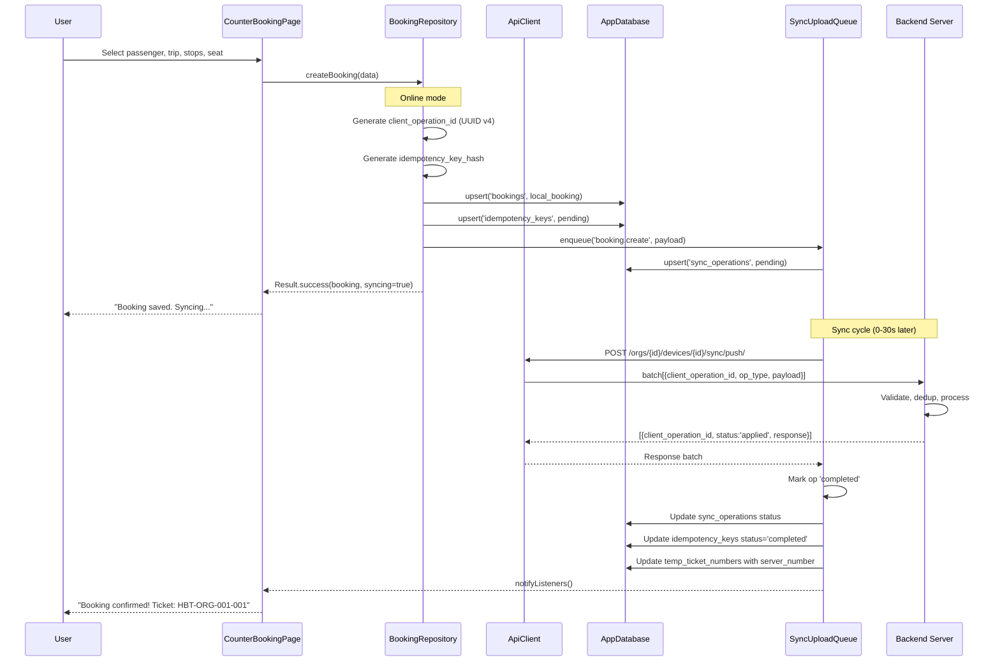
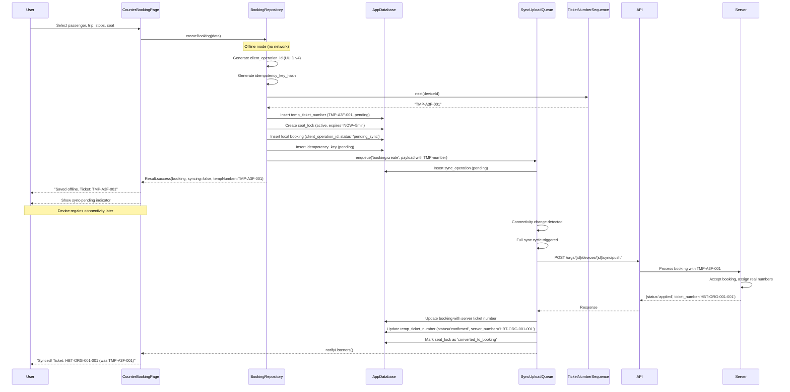
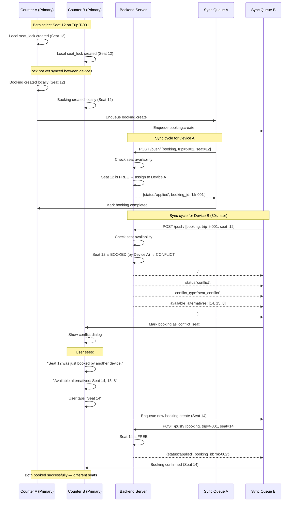
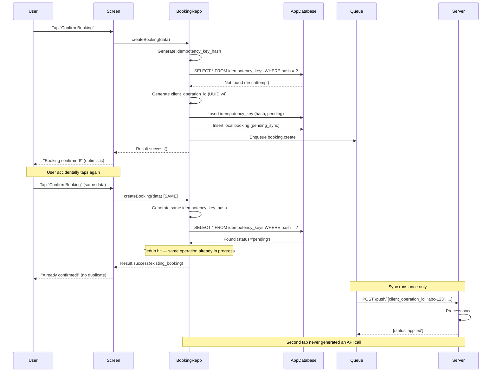
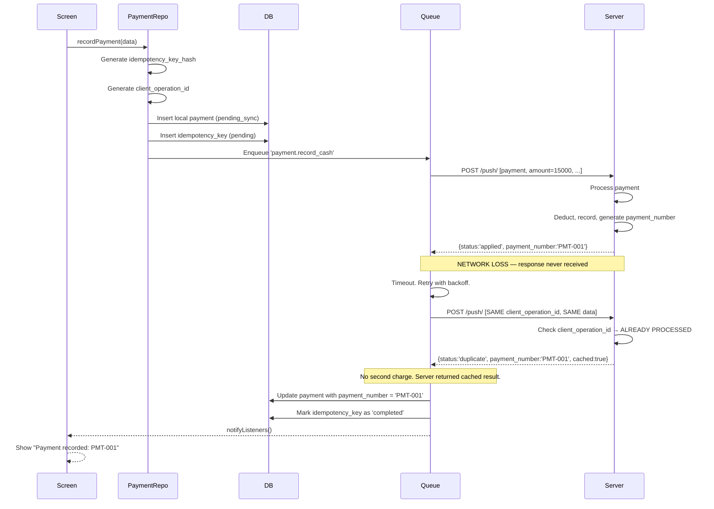
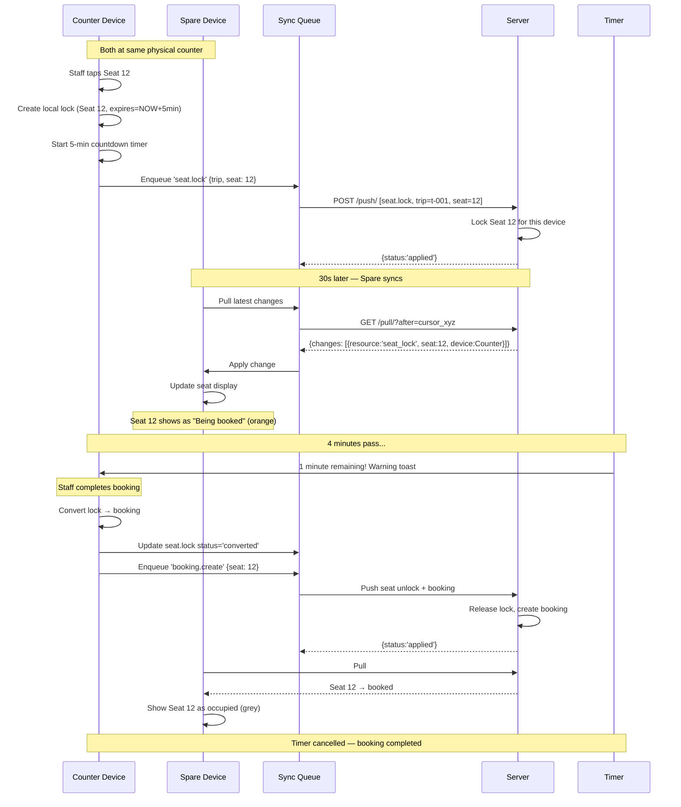
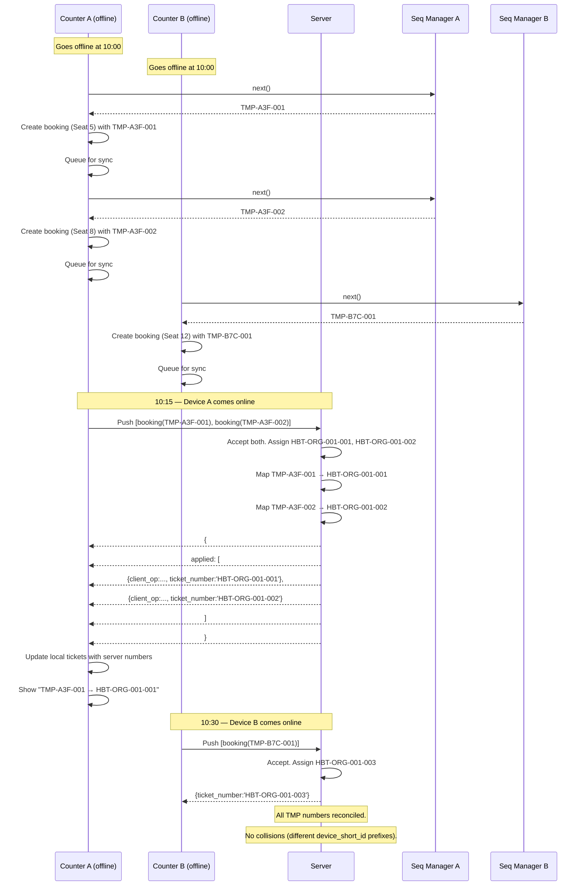
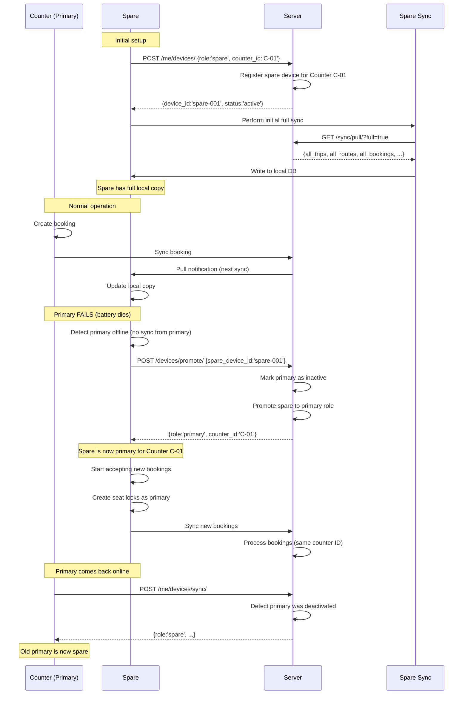
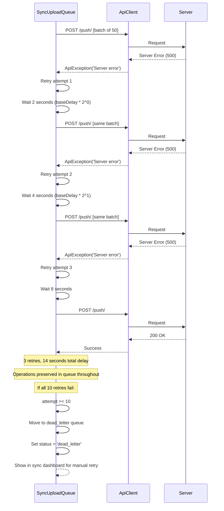
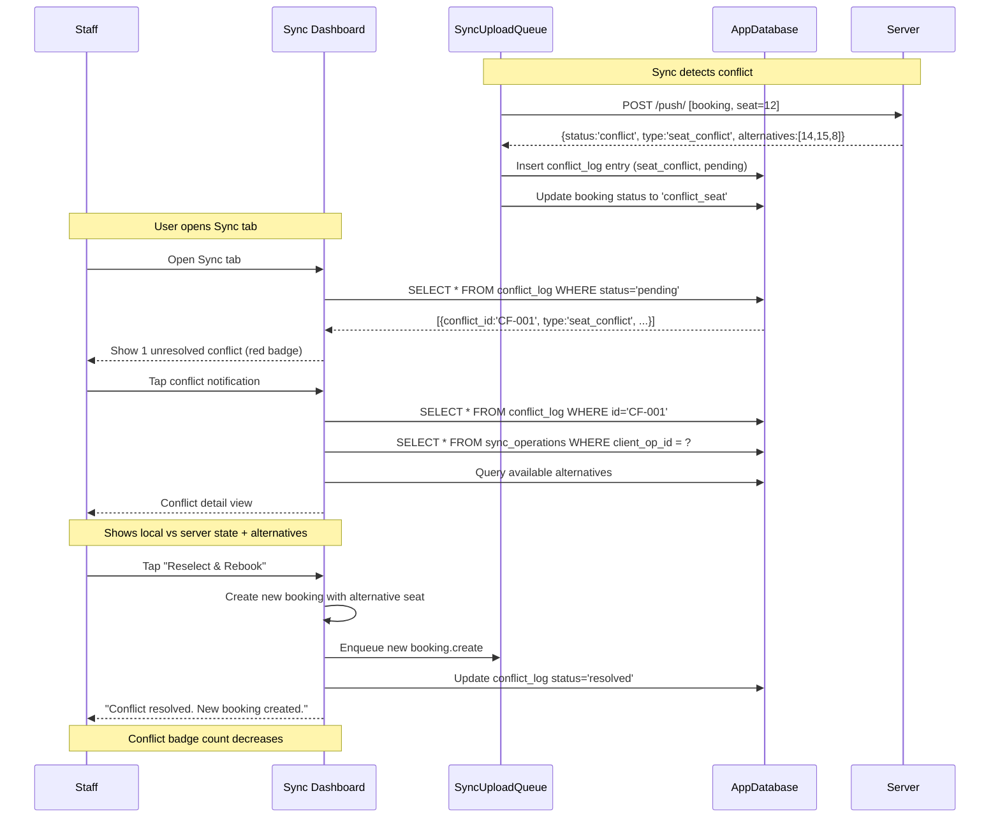

# Offline Sequence Diagrams — HBT Business App

**Document:** Swimlane sequence diagrams for key offline-first workflows
**Format:** Mermaid.js (renders on GitHub/GitLab or any Mermaid-compatible viewer)
**Status:** Design proposal

---

## Diagram 1: Normal Online Booking Flow

---

## Diagram 2: Offline Booking Flow

---

## Diagram 3: Seat Conflict Resolution

---

## Diagram 4: Booking Idempotency (Double-Tap Prevention)

---

## Diagram 5: Payment Idempotency (Network Loss After Server Process)

---

## Diagram 6: Seat Lock Protocol (Counter + Spare)

---

## Diagram 7: Temporary Ticket Number Reconciliation

---

## Diagram 8: Multi-Device Spare Promotion

---

## Diagram 9: Sync Retry with Exponential Backoff

---

## Diagram 10: Conflict Dashboard Flow

---

## Diagram Legend

| Symbol | Meaning |
|--------|---------|
| `->>` | Synchronous/async call |
| `-->>` | Return/response |
| `Note over X` | Annotation over a participant or time span |
| `participant X as Label` | Participant with display label |
| `Box colour` | N/A (Mermaid renders in greyscale by default) |
