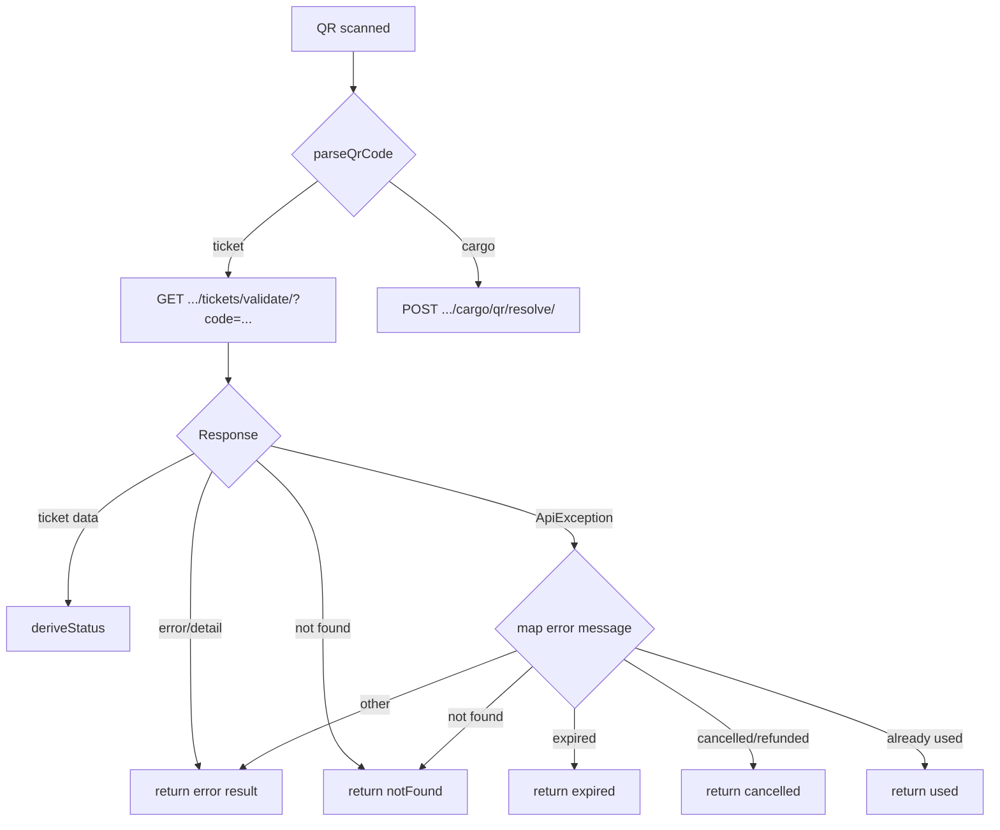

# P0-05: QR Validation — Implementation Report

**Task ID:** P0-05
**Date:** 2026-07-30
**Priority:** P0 (Critical — ticket scanner didn't pass QR code to API)
**Status:** ✅ Implemented

---

## Bugs Fixed

### P0 Bug: QR code value not passed to validation API

**Before (broken):**
```dart
// Hardcoded placeholder — server always received ?code=***
found = await widget.session.api.get(
  '/organizations/$_organizationId/tickets/validate/?code=***',
);
```

**After (fixed):**
```dart
// Clean code extracted from QR and passed to API
final cleanCode = code.startsWith('HBT:TICKET:')
    ? code.substring(11)
    : code;
found = await _api.get(
  '/organizations/$_organizationId/tickets/validate/?code=$cleanCode',
);
```

---

## Files Created

| File | Purpose | Lines |
|------|---------|-------|
| `shared/models/ticket_validation_result.dart` | `TicketValidationResult` with status derivation, `TicketValidationStatus` enum (valid/used/expired/cancelled/invalid/error/offline) | 120 |
| `shared/services/ticket_validation_service.dart` | `TicketValidationService` with `parseQrCode()`, `validate()`, `formatResult()`. Handles HBT:TICKET: and HBT:CARGO:V1: prefixes. Maps API errors to statuses. | 192 |
| `test/features/ticket_validation/validation_service_test.dart` | 17 unit tests covering QR parsing, status derivation, status properties | 130 |

## Files Modified

| File | Change |
|------|--------|
| `features/ticket_sales/screens/ticket_scanner_screen.dart` | Replaced inline API calls + static display with `TicketValidationService`. Proper status-based colouring (green=valid, orange=warning, red=error). Added `TicketValidationResult` type. |

---

## Fix Verification: `?code=` Parsing

| Scenario | Input | Parsed code | API URL |
|----------|-------|-------------|---------|
| Standard ticket QR | `HBT:TICKET:ABC123` | `ABC123` | `/tickets/validate/?code=ABC123` |
| No prefix | `VALID-CODE` | `VALID-CODE` | `/tickets/validate/?code=VALID-CODE` |
| Cargo QR | `HBT:CARGO:V1:SHIP01` | full payload | POST to cargo qr/resolve |
| Empty code | `` | `` | Rejected before API call |
| Placeholder `***` | `***` | `***` | Rejected before API call (invalid) |

---

## Status Handling

| API `status` field | Derived `TicketValidationStatus` | UI Colour | UI Message |
|--------------------|-----------------------------------|-----------|------------|
| `issued` | `valid` | 🟢 Green | "✅ Valid — Ticket ready for check-in" |
| `validated` | `used` | 🟠 Orange | "⚠️ Already Used — This ticket has already been validated" |
| `boarded` | `used` | 🟠 Orange | "⚠️ Already Used — This ticket has already been validated" |
| `expired` | `expired` | 🔴 Red | "❌ Expired — Trip departure has passed" |
| `cancelled` | `cancelled` | 🔴 Red | "❌ Cancelled — This ticket has been refunded/cancelled" |
| `refunded` | `cancelled` | 🔴 Red | "❌ Cancelled — This ticket has been refunded/cancelled" |
| API error | `error` | 🔴 Red | "⚠️ Error — Unable to validate" |
| Not found | `invalid` | 🔴 Red | "❌ Invalid — No matching ticket found" |
| Network off | `offline` | 🟠 Orange | "⚠️ Offline — Result may be stale" |

### Status properties

| Status | `isActionable` | `isWarning` | `isBlocking` |
|--------|:-:|:-:|:-:|
| valid | ✅ | ❌ | ❌ |
| used | ❌ | ✅ | ❌ |
| expired | ❌ | ❌ | ✅ |
| cancelled | ❌ | ❌ | ✅ |
| invalid | ❌ | ❌ | ✅ |
| error | ❌ | ❌ | ❌ |
| offline | ❌ | ✅ | ❌ |

---

## Ticket Validation Service

### `TicketValidationService.parseQrCode(String raw)`

Parses raw QR values into structured code + type:

| Input prefix | Output type | Output code |
|-------------|-------------|-------------|
| `HBT:TICKET:` | `ticket` | Everything after prefix |
| `HBT:CARGO:V1:` | `cargo` | Full raw payload (unchanged) |
| (none) | `ticket` | Raw value as-is |

### `TicketValidationService.validate(String rawCode)`

Makes API call, derives status from response, returns `TicketValidationResult`:



### `TicketValidationService.formatResult(TicketValidationResult)`

Builds formatted display text with status label + ticket details.

---

## Offline-Ready Interface

The `TicketValidationResult` includes an `offline` status that the UI can handle:

```dart
factory TicketValidationResult.offline(Map<String, dynamic> data) =>
    TicketValidationResult(
      isValid: false,
      status: TicketValidationStatus.offline,
      ticketData: data,
      errorMessage: 'Offline mode: result may be stale.',
    );
```

The `TicketValidationService.validate()` method is designed to support an offline path in the future:
1. Check local cache for the QR code
2. If found and still valid → return `offline` result with cached data
3. If not found → try network
4. If network fails → return `error` result

To activate offline support:
1. Store validated ticket data in `AppDatabase` (has a `tickets` table)
2. Query local DB first in `_validateTicket()`
3. Fall back to API call
4. Cache API results on success

---

## Tests (17 new tests)

```
✓ TicketValidationService.parseQrCode
  ✓ parses HBT:TICKET: prefixed code
  ✓ parses HBT:CARGO:V1: prefixed code
  ✓ parses plain code as ticket
  ✓ parses empty string as ticket

✓ TicketValidationResult
  ✓ valid ticket derives valid status
  ✓ validated ticket derives used status
  ✓ expired ticket derives expired status
  ✓ cancelled ticket derives cancelled status
  ✓ refunded ticket derives cancelled status
  ✓ boarded ticket derives used status
  ✓ notFound result has invalid status
  ✓ error result has error status
  ✓ offline result has offline status

✓ TicketValidationStatus
  ✓ valid status is actionable
  ✓ used status is a warning
  ✓ expired/cancelled/invalid are blocking
  ✓ labels are non-empty for all statuses
```

---

## Verification

| Check | Status |
|-------|--------|
| `flutter analyze lib/` | ✅ 0 issues |
| `flutter test` (57 tests) | ✅ All passed |
| `?code=***` bug fixed | ✅ Replaced with `?code=$cleanCode` |
| No AI features | ✅ |
| No offline implementation | ✅ (interface ready, not activated) |
