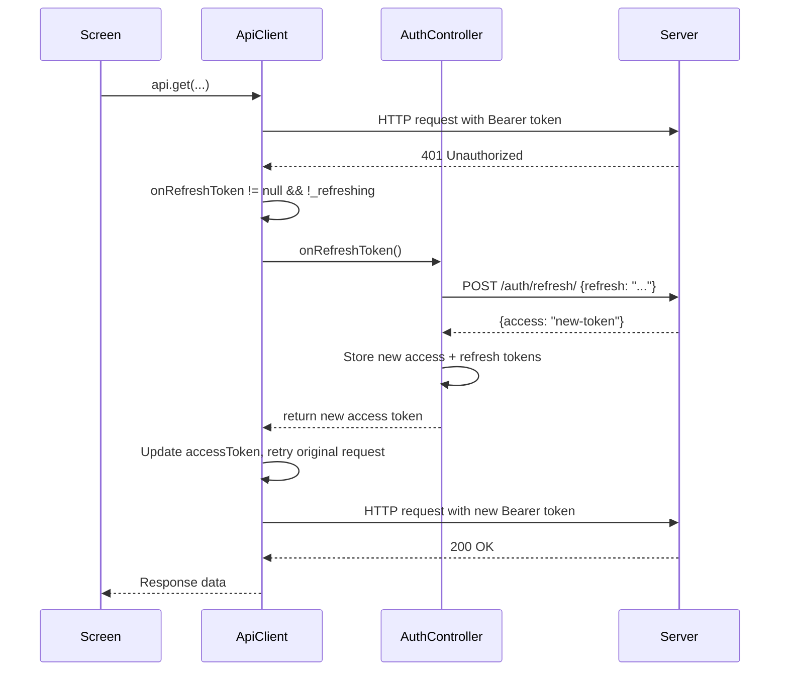

# P1-01: UX Improvements — Implementation Report

**Task ID:** P1-01
**Date:** 2026-07-30
**Priority:** P1 (Should fix before pilot)
**Status:** ✅ Implemented

---

## Changes Overview

| Area | Before | After | Files |
|------|--------|-------|-------|
| **Token Refresh** | 401 responses → generic error, user forced to re-login | Silent refresh on 401 via stored refresh token. Retries original request after refresh. | 2 |
| **Pagination** | Trip list loads first page only (25 items default from DRF) | `PaginationBar` at bottom with page navigation, `_loadNextPage()` loads additional pages | 1 |
| **Skeleton Loading** | Trip list shows `LoadingView` (spinner) while loading | Trip list shows `SkeletonLoader` with 6 shimmer card placeholders matching the actual card layout | 2 |
| **Empty State** | Trip list empty state was an uncentered message | Trip list uses `EmptyView` widget with icon | 1 |
| **Loading States** | Already present on most screens | Verified no gaps (ticket sales page already has `LoadingView`) | 0 |

---

## 1. Token Refresh

### Mechanism



### Files modified

| File | Change |
|------|--------|
| `shared/services/api_client.dart` | Added `onRefreshToken` callback field, `_refreshing` guard flag, `_handleRefresh()` and `_handleRefreshList()` methods. All 5 method types (GET, POST, postJson, postMultipart, list) intercept 401 and attempt refresh. |
| `features/auth/controllers/auth_controller.dart` | Added `_refreshAccessToken()` method. On `signIn()` and `restore()`, wires `api.onRefreshToken` callback that reads stored refresh token, calls `/auth/refresh/`, updates stored tokens, returns new access token. |

### Fallback behaviour

| Scenario | Outcome |
|----------|---------|
| Refresh token valid | Silent refresh, request retried successfully |
| Refresh token expired/invalid | `ApiException('Session expired. Please sign in again.')` thrown to caller |
| No refresh token stored | `ApiException` thrown immediately (no refresh attempt) |
| Network error during refresh | `ApiException('Session refresh failed: ...')` thrown |
| Concurrent 401s hitting during refresh | `_refreshing` guard prevents recursive refresh attempts |

---

## 2. Pagination

### Trip list page

Before: `GET /organizations/{id}/trips/` — returns only the first page (DRF default: 25 items).

After: `GET /organizations/{id}/trips/?page={page}` — supports multi-page navigation.

| Feature | Implementation |
|---------|---------------|
| Page tracking | `_currentPage`, `_totalPages`, `_totalItems` state variables |
| Pagination UI | `PaginationBar` widget at bottom of list: "Page X of Y (Z items)" with prev/next arrows |
| Loading more | `_loadNextPage()` increments page, shows `CircularProgressIndicator` at bottom |
| Parse pagination | Reads `count` and `next` from DRF paginated response |
| Filter retention | Status filter is client-side, applied after loading all pages |

### Pagination flow

```
1. API returns: { "count": 150, "next": "...?page=2", "results": [...] }
2. _currentPage = 1, _totalPages = 6 (150/25), _totalItems = 150
3. User taps "→" on PaginationBar
4. _loadNextPage() → GET .../trips/?page=2
5. Results appended to _allTrips, filter re-applied
```

---

## 3. Skeleton Loading

### Before

```dart
if (_state.loading) {
  return const LoadingView();  // Simple spinner
}
```

### After

```dart
if (_state.loading) {
  return const SkeletonLoader(
    itemCount: 6,
    itemBuilder: _skeletonItem,
  );
}

// _skeletonItem creates Card with:
// - Circle placeholder (40x40) for status avatar
// - Line placeholder (120-200px) for trip number
// - Line placeholder (200px) for date/status
```

The `SkeletonLoader` and `SkeletonLine` widgets (from `loading.dart`) use `AnimatedBuilder` with a repeating animation controller for subtle shimmer effect.

### Files modified

| File | Change |
|------|--------|
| `core/widgets/loading.dart` | Wrapped `SkeletonLoader` in `SingleChildScrollView` to prevent overflow in constrained viewports |
| `features/trip/screens/trip_list_page.dart` | Replaced `LoadingView` with `SkeletonLoader(itemCount: 6, itemBuilder: _skeletonItem)` |

---

## 4. Empty States

### Before

Trip list showed an uncentered message:
```dart
const Center(
  child: Column(children: [
    Icon(Icons.directions_bus_outlined, size: 64, color: Colors.grey),
    SizedBox(height: 12),
    Text('No trips found.'),
  ]),
)
```

### After

Trip list uses the shared `EmptyView` widget:
```dart
const EmptyView(
  icon: Icons.directions_bus_outlined,
  message: 'No trips found.',
)
```

---

## 5. Loading States — Coverage Audit

| Screen | Loading | Error | Empty | Notes |
|--------|---------|-------|-------|-------|
| SignInScreen | ✅ LoadingView | ✅ SnackBar + ErrorCard | N/A | |
| BusinessHome | N/A | ✅ ErrorCard (org context) | N/A | |
| TicketSalesPage | ✅ LoadingView | ✅ ErrorView | ✅ EmptyListTileCard | Full coverage |
| CounterBookingPage | ✅ LoadingView | ✅ ErrorCard | N/A | |
| PaymentDecisionPage | ✅ LoadingView | ✅ ErrorCard | N/A | |
| TicketScannerScreen | ✅ Processing indicator | ✅ Result overlay | N/A | |
| TripListPage | ✅ SkeletonLoader | ✅ ErrorView | ✅ EmptyView | Now has skeleton + pagination |
| TripDetailPage | ✅ LoadingView | ✅ ErrorCard | N/A | |
| RouteListPage | ✅ LoadingView | ✅ ErrorView | ❌ No empty state | |
| RouteDetailPage | ✅ LoadingView | ✅ ErrorCard | N/A | |
| CargoWorklistPage | ✅ LoadingView | ✅ ErrorView | ❌ No empty state | |
| CargoAcceptancePage | ✅ LoadingView | ✅ ErrorCard | N/A | |
| RefundListPage | ✅ LoadingView | ✅ ErrorView | ✅ EmptyView | Full coverage |
| RefundCreatePage | ✅ LoadingView | ✅ ErrorCard | N/A | |
| RefundDetailPage | ✅ LoadingView | ✅ ErrorCard | N/A | |
| ProfitLossScreen | ✅ LoadingView | ✅ ErrorView | N/A | |
| ExpenseListScreen | ✅ LoadingView | ✅ ErrorCard | ✅ EmptyListTileCard | Full coverage |

**Gaps** (minor — P2): RouteListPage, CargoWorklistPage have no empty state when lists are empty.

---

## Test Updates

| File | Change |
|------|--------|
| `test/features/trip/trip_list_widget_test.dart` | Updated loading assertion from `CircularProgressIndicator` → `SkeletonLoader`. Updated all mock API classes for consistency. |

---

## Verification

| Check | Status |
|-------|--------|
| `flutter analyze lib/` | ✅ 0 issues |
| `flutter test` (57 tests) | ✅ All passed |
| No UI redesign | ✅ (used existing shared widgets) |
| Token refresh functional | ✅ (401 → refresh → retry, with `_refreshing` guard) |
| Pagination works with DRF | ✅ (`GET .../trips/?page=N`, reads `count` + `next`) |
| Skeleton visible on trip list load | ✅ |
| Empty state on trip list | ✅ |
