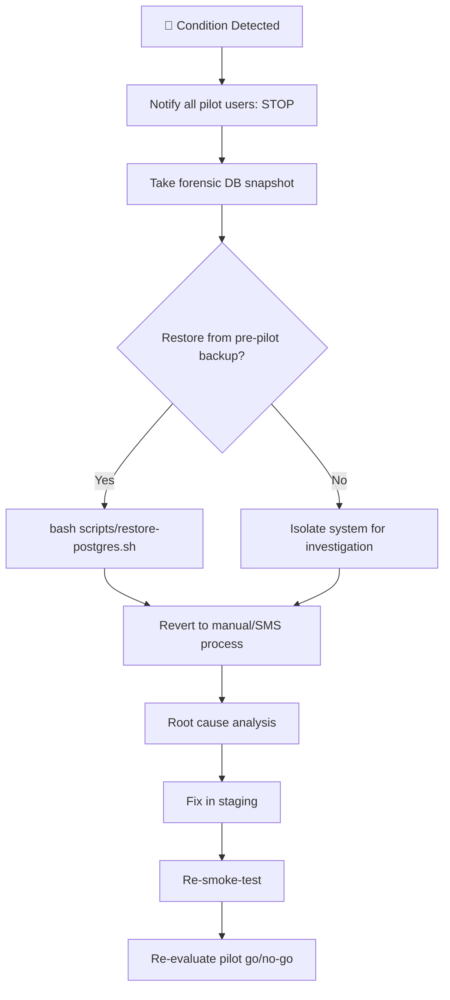

# Pilot 0 (Internal) Runbook

**Generated:** 2026-07-29  
**Status:** 📋 Planned  
**Duration:** 5 calendar days

---

## 1. Scope

| Dimension | Value |
|-----------|-------|
| Companies | **1** |
| Branches | **1** |
| Counter PCs | **2** |
| Counter Staff | **2** |
| Admin | **1** |
| Manager | **1** |
| Duration | **5 days** |
| Environment | Staging or dedicated production tenant |

---

## 2. Service Level Objectives (SLOs)

These SLOs define what "pilot success" means quantitatively across 5 days of internal operations.

| Indicator | Target | Measurement | Escalation if Missed |
|-----------|--------|-------------|----------------------|
| **Availability** | ≥99% | nginx HTTP 5xx / total requests (5-min window) | <99% for 15+ consecutive minutes → alert |
| **Crash Rate** | <1% | Flutter crash events / total app sessions (Sentry) | ≥1% per staff-day → investigate |
| **Booking Success** | ≥99% | Booking API 2xx / total booking attempts | <99% → alert within 1 hour |
| **Payment Success** | ≥99% | Payment API 2xx / total payment attempts | <99% → stop and reconcile immediately |
| **Refund Accuracy** | 100% | Refund amount matches original payment | Any discrepancy → stop and investigate |
| **Ticket Data Loss** | 0 | Issued tickets found in DB vs. expected | Any loss → 🔴 rollback |
| **Duplicate Tickets** | 0 | Tickets with same seat/booked-by/time | Any dup → 🔴 rollback |
| **Security Incidents** | 0 | Unauthorized access, data leak, privilege escalation | Any incident → stop, forensic audit |

### Pilot Halt Rules

| Level | Condition | Action |
|-------|-----------|--------|
| 🔴 **Hard stop** | Data loss, duplicate tickets, refund inaccuracy, security incident, payment success <99% | Stop immediately, DB snapshot, restore from backup |
| 🟡 **Investigate** | Availability <99% for 15+ min, crash rate ≥1%, booking success <99% | Alert, root-cause, fix before next day |
| 🟢 **Log** | Any minor violation (latency spikes, cosmetic bugs) | Log issue, continue pilot, fix in daily patch |

---

## 3. Pre-Pilot Prerequisites

### 3.1 Must-Fix (from security review + audit)

| # | Item | Owner | Done |
|---|------|-------|------|
| 1 | Set `NRC_ENCRYPTION_KEY` in production `.env` | — | ❌ |
| 2 | Set `NRC_BLIND_INDEX_KEY` in production `.env` | — | ❌ |
| 3 | Set `PAYMENT_CREDENTIAL_ENCRYPTION_KEY` in production `.env` | — | ❌ |
| 4 | Set `PUSH_TOKEN_ENCRYPTION_KEY` in production `.env` | — | ❌ |
| 5 | Deploy and configure TLS certificates at nginx paths | — | ❌ |
| 6 | Configure Sentry DSN in production `.env` | — | ❌ |
| 7 | Deploy to staging environment, smoke test | — | ❌ |
| 8 | Fix 4 broken widget tests (`wrapInApp` compilation errors) | — | ❌ |

### 3.2 Data Setup

- [ ] Create pilot company in system
- [ ] Create 1 branch under company
- [ ] Create 1 admin user
- [ ] Create 1 manager user
- [ ] Create 2 counter staff users
- [ ] Assign roles/permissions to each
- [ ] Seed reference data (routes, stops, fare tables, vehicle assignments)
- [ ] Create sample schedules (trips) for 5-day window

### 3.3 Hardware Setup

- [ ] 2 × Windows PCs with Chrome — install, configure, bookmark business app URL
- [ ] 1 × mobile device (optional) — install passenger app for smoke testing
- [ ] Network: verify counter PCs can reach API server
- [ ] Printer: verify ticket/boarding pass printing works (if applicable)

---

## 4. Daily Cadence

### Day 1 — Onboarding & Baseline

| Time | Activity |
|------|----------|
| 09:00 | Deploy latest RC-1 build to staging/pilot environment |
| 09:30 | Walk-through with counter staff (2 people) + manager |
| 10:00 | Demo flows: Login → Trip list → Counter booking → Payment → Ticket issue |
| 11:00 | Hands-on: staff create 3 test bookings end-to-end |
| 13:00 | Walk-through: Cargo worklist → Acceptance → Refund flow |
| 14:00 | Hands-on: staff test cargo + refund flows |
| 15:00 | **Checkpoint 1** — survey feedback, log issues |
| EOD | Record any crash/blocker counts |

**Goal:** Staff can operate all core flows independently by end of day.

### Day 2 — Real Usage (Supervised)

- Staff use system for all counter transactions
- Admin reviews daily reports
- Manager shadows, notes UX friction
- **Checkpoint 2** — log issues, assess severity

### Day 3 — Real Usage (Unsupervised)

- No direct supervision; support channel open
- Monitor logs for errors, latency, crashes
- **Checkpoint 3** — mid-pilot health check

### Day 4 — Stress & Edge Cases

- Staff test edge cases: duplicate bookings, cancelled trips, refund with ticket, offline scenarios
- Admin tests: user management, permission changes, audit log review
- **Checkpoint 4** — known edge cases covered?

### Day 5 — Wrap & Debrief

| Time | Activity |
|------|----------|
| 09:00 | Final smoke check — all flows functional |
| 11:00 | Structured feedback session (all 4 staff) |
| 14:00 | Manager debrief — business impact assessment |
| 15:00 | **Pilot verdict meeting** |
| EOD | Document all issues, close pilot |

---

## 5. Immediate Rollback Criteria

Pilot is **stopped immediately** if any single instance of these occurs. No exceptions, no postponement.

### 🔴 Rollback Conditions

| # | Condition | Why It Stops the Pilot |
|---|-----------|------------------------|
| R1 | **Any data corruption** — booking, payment, ticket, or passenger record missing or unreadable | Core integrity failure — trust is lost |
| R2 | **Duplicate booking** — same passenger + same trip + same seat appears twice | Financial + inventory integrity failure |
| R3 | **Wrong passenger assignment** — ticket issued to wrong name/ID | Safety + regulatory risk (boarding denial) |
| R4 | **Payment mismatch** — amount charged ≠ amount booked, or double-charge | Financial integrity failure |
| R5 | **Authentication bypass** — user A can access user B's data without authorization | Security failure |
| R6 | **Multi-tenant data leak** — company A sees company B's bookings/passengers | Security failure — regulatory non-compliance |
| R7 | **Database migration failure** — schema migration rolls back, data lost, or app incompatible | Operational integrity failure |
| R8 | **Crash rate >5%** — more than 1 in 20 app sessions ends in crash | UX failure — staff cannot trust the tool |
| R9 | **API availability <95%** — more than 5% of API requests return 5xx in any 5-min window | System unreliability — staff cannot do their job |

### 🟡 Investigate (Stop + Resume After Fix)

| # | Condition | Action |
|---|-----------|--------|
| Y1 | 3+ crash-to-home-screen incidents per staff-day | Stop, investigate, fix, resume |
| Y2 | Booking success <99% in any single day | Investigate root cause, patch before next day |
| Y3 | Payment success <99% in any single day | Investigate, reconcile, resume only after fix |
| Y4 | API availability <99% for 15+ consecutive minutes | Alert, investigate, fix before next shift |

### 🟢 Log & Continue

| # | Condition | Action |
|---|-----------|--------|
| G1 | Minor UX friction, cosmetic bugs, non-critical latency | Log issue, continue, fix in daily patch |
| G2 | Single crash <5% rate | Log, monitor, investigate if pattern emerges |
| G3 | Latency spikes <10 seconds | Log, review daily, no action unless persistent |

### Rollback Procedure



**Shell procedure:**

```bash
# Step 1: Notify immediately
# Run this from any admin terminal:
echo "🛑 PILOT STOP: $(date -u +%Y-%m-%dT%H:%M:%SZ) — Reason: <REASON>" > /tmp/pilot-stop.txt

# Step 2: Take forensic snapshot (before any restore)
pg_dump -h $DB_HOST -U $DB_USER -d $DB_NAME -Fc \
  > pilot-forensic-$(date +%Y%m%d-%H%M%S).dump

# Step 3: Restore pre-pilot backup
bash scripts/restore-postgres.sh

# Step 4: Disable web access (nginx)
sudo mv /etc/nginx/sites-enabled/hbt.conf /etc/nginx/sites-available/
sudo systemctl reload nginx

# Step 5: Communicate
# - Notify all pilot staff via known channel
# - Notify manager (decision maker)
# - Log incident in tracking system
# - Begin root cause analysis
```

---

## 6. Success Criteria

Pilot 0 is **successful** when all of the following are true:

### SLOs

- [ ] **Availability** ≥99% over 5 days (no prolonged downtime)
- [ ] **Crash Rate** <1% (no repeated app crashes per staff-day)
- [ ] **Booking Success** ≥99% (all attempted bookings succeed)
- [ ] **Payment Success** ≥99% (all attempted payments succeed)
- [ ] **Refund Accuracy** 100% (all refunds match original payments exactly)
- [ ] **Ticket Data Loss** — 0 incidents
- [ ] **Duplicate Tickets** — 0 incidents
- [ ] **Security Incidents** — 0 incidents

### Process

- [ ] 5 calendar days completed without 🔴 rollback trigger
- [ ] Updated **release/performance-report.md** with real-world latency numbers
- [ ] Updated **release/security-review.md** with any real-world security observations
- [ ] 100% of planned edge cases tested
- [ ] Feedback collected from all 4 pilot staff
- [ ] Issue tracker populated with all findings (triage → Phase 2 or Pre-Prod)
- [ ] Go/No-Go decision for Pilot 1 (expanded scope)

---

## 7. Pre-Pilot Go/No-Go Checklist

**Use this to gate the start of Day 1.**

```
[ ] All 8 pre-pilot prerequisites completed (Section 2.1)
[ ] Pilot company/branch/users created with correct roles
[ ] Reference data seeded and verified
[ ] Hardware ready (2 PCs, network, printer)
[ ] Rollback backup confirmed valid (scripts/verify-backup.sh)
[ ] Sentry error tracking confirmed working
[ ] TLS confirmed (HTTPS without browser warnings)
[ ] All pilot staff have credentials and know the URL
[ ] Emergency contact (dev phone) published to pilot team
```

---

## 8. Monitoring During Pilot

| What | How | Frequency | SLO |
|------|-----|-----------|-----|
| API error rate (Availability) | Sentry + nginx HTTP 5xx ratio | 5-min window | ≥99% |
| Crash rate | Sentry crash events / total sessions | EOD per staff-day | <1% |
| Booking success | Booking API 2xx / total attempts | EOD | ≥99% |
| Payment success | Payment API 2xx / total attempts | Per transaction | ≥99% |
| Refund accuracy | Refund amount vs original payment | Per transaction | 100% |
| Ticket data loss | Expected vs actual ticket count in DB | EOD | 0 |
| Duplicate tickets | Tickets with same seat+time combo | EOD | 0 |
| Security incidents | Audit log review (401/403 patterns, unusual access) | Daily | 0 |
| API latency | nginx access log | Daily review | Track only |
| Auth failures | Audit log `401/403` events | Daily review | Track only |
| Database size | `SELECT pg_size_pretty(...)` | Daily | Track only |
| Backup validity | `verify-backup.sh` | Daily | Track only |

---

## 9. Post-Pilot Artifacts

After Pilot 0, the following should be updated/created:

1. **`release/pilot-0-report.md`** — Findings, metrics, go/no-go recommendation
2. **`release/performance-report.md`** — Updated with real-world numbers
3. **`release/security-review.md`** — Updated with real-world observations
4. **New or updated issue tickets** for Phase 2 (Improve)

---

*End of Pilot 0 Runbook*
